# 中药—肠道菌群—宿主—疾病数据库 ER 设计汇报（第一版）

目标Notion页面：https://app.notion.com/p/3e4d010b1b5c80abbd28eb27c75208d5
准备日期：2026-10-08。设计基线：codex/tcm-gut-er-v2，提交06b94eaa34799c7ef444fbb171bbb17d0921d2cb。
这是一份汇报内容稿，不表示已上传到Notion。SQL来源：[第一版方案](https://github.com/bal483836-ctrl/Knowledge-graph-extraction-and-fusion/tree/codex/tcm-gut-er-v2)。

## 先确定汇报逻辑：15分钟讲什么

今天要回答的不是“有多少张表”，而是：
**图1三条路径中的每一步，怎样被数据库准确记录；不知道的机制怎样保留；以后怎样补齐功能基因和酶。**

| 时间 | 环节 | 讲清楚什么 |
|---|---|---|
| 0:00–1:00 | 图1切入 | 三条路径共享哪些对象，差异在哪里 |
| 1:00–2:00 | ER阅读规则 | 对象、关系、证据；连线不是生物作用箭头 |
| 2:00–4:00 | 路径① | 原型成分直接作用，区分基因表达与靶点作用 |
| 4:00–7:00 | 路径② | 反应与转化观察分开，基因和酶放在哪 |
| 7:00–10:00 | 路径③ | 菌群组成、功能与交叉喂养如何记录 |
| 10:00–12:00 | 合并ER图 | 共享实体与关系复用，26表路径总览 |
| 12:00–14:00 | 剩余12表 | 证据、功能注释、疾病结局补充 |
| 14:00–15:00 | 实施与边界 | 第一版做到什么，下一步怎样完善 |

### 开场讲稿（约一分钟）

“老师，这次设计我从框架图的三条作用路径入手。第一条是原型成分直接作用宿主；
第二条是成分先经过肠道菌群转化，代谢物再作用宿主；第三条是成分改变菌群组成或功能，
进一步改变代谢产物。三条路径虽然机制不同，但都涉及化合物、宿主靶点和疾病，
所以数据库既要表达它们的差异，也要复用共同实体。
我会先分别展示三条路径的ER图，再合并展示整体结构，最后解释证据表以及功能基因和酶的扩展设计。”

## 图例：先教老师怎样看本次ER图

- 方框：一张表；中文说明用途，英文对应SQL表名。
- PK：主键，一行记录的内部编号；FK：外键，指向另一张表。
- `||`：关系行必须有一个对应对象；`|o`：对应对象可以未知；`o{`：对象可以对应零到多条记录。
- 实线表示数据库外键连接，**不是“促进/抑制/导致”的生物作用方向**。
- donor_id/recipient_id、substrate/product、action/direction等字段才表达生物方向与语义。
- 展示图只列主要字段，并省略模块外外键；完整约束以schema.sql为准。
- observation是每张路径图的证据入口；同一篇文献可以有多个观察。
- 一条路径可检索，不代表其全链因果已验证。

例子：“compound `||--o{` compound_target”表示：
每一条成分—靶点关系必须指向一个成分；一个成分可以有多条靶点关系记录。
它不表示这个成分一定激活靶点；激活还是抑制看action字段。

## 一、路径①：原型成分直接作用宿主

### 1. 用一句话讲机制

**原型成分保持化学身份，在入血相关情境或肠道局部影响宿主靶点/基因，再与疾病相关过程相联系。**
原型检出、靶点作用和疾病作用是不同证据，不因“直接路径”而自动合并。

### 2. 中英文ER图：Route 1 — Direct Action

```mermaid
erDiagram
  compound["化合物 Compound"] {
    bigint id PK "内部编号 ID"
    text name "名称 Name"
    string inchikey "结构键 InChIKey"
    text identity_status "identity_status"
  }
  herb["中药 Herb"] {
    bigint id PK "内部编号 ID"
    text name "名称 Name"
    text medicinal_part "medicinal_part"
    text processing "processing"
  }
  host_gene["宿主基因 Host Gene"] {
    bigint id PK "内部编号 ID"
    bigint host_taxid "宿主物种 Host taxid"
    text symbol "symbol"
    text gene_accession "gene_accession"
  }
  host_target["宿主靶点 Host Target"] {
    bigint id PK "内部编号 ID"
    bigint host_taxid "宿主物种 Host taxid"
    text name "名称 Name"
    text kind "类别 Kind"
    text accession "登录号 Accession"
  }
  host_gene_product["宿主基因产物 Host Gene Product"] {
    bigint gene_id PK,FK "关联编号 Foreign ID"
    bigint target_id PK,FK "关联编号 Foreign ID"
  }
  disease["疾病 Disease"] {
    bigint id PK "内部编号 ID"
    text name "名称 Name"
    text ontology "ontology"
    text accession "登录号 Accession"
  }
  observation["观察证据 Observation"] {
    bigint id PK "内部编号 ID"
    bigint experiment_id FK "关联编号 Foreign ID"
    bigint context_id "关联编号 Foreign ID"
    bigint subject_arm_id "关联编号 Foreign ID"
    bigint control_arm_id "关联编号 Foreign ID"
  }
  herb_compound["中药含成分 Herb Compound"] {
    bigint id PK "内部编号 ID"
    bigint herb_id FK "关联编号 Foreign ID"
    bigint compound_id FK "关联编号 Foreign ID"
    bigint observation_id FK "关联编号 Foreign ID"
    text role "关系角色 Role"
  }
  compound_target["成分靶点作用 Compound Target"] {
    bigint id PK "内部编号 ID"
    bigint compound_id FK "关联编号 Foreign ID"
    bigint target_id FK "关联编号 Foreign ID"
    bigint observation_id FK "关联编号 Foreign ID"
    text action "作用方式 Action"
  }
  compound_host_gene["成分调控宿主基因 Compound Host Gene"] {
    bigint id PK "内部编号 ID"
    bigint compound_id FK "关联编号 Foreign ID"
    bigint gene_id FK "关联编号 Foreign ID"
    bigint observation_id FK "关联编号 Foreign ID"
    text action "作用方式 Action"
  }
  target_disease["靶点疾病关系 Target Disease"] {
    bigint id PK "内部编号 ID"
    bigint target_id FK "关联编号 Foreign ID"
    bigint disease_id FK "关联编号 Foreign ID"
    bigint observation_id FK "关联编号 Foreign ID"
    text relation "关系类型 Relation"
  }
  host_gene ||--o{ host_gene_product : "gene_id 关联 Link"
  host_target ||--o{ host_gene_product : "target_id 关联 Link"
  herb ||--o{ herb_compound : "herb_id 关联 Link"
  compound ||--o{ herb_compound : "compound_id 关联 Link"
  observation ||--o{ herb_compound : "observation_id 关联 Link"
  compound ||--o{ compound_target : "compound_id 关联 Link"
  host_target ||--o{ compound_target : "target_id 关联 Link"
  observation ||--o{ compound_target : "observation_id 关联 Link"
  compound ||--o{ compound_host_gene : "compound_id 关联 Link"
  host_gene ||--o{ compound_host_gene : "gene_id 关联 Link"
  observation ||--o{ compound_host_gene : "observation_id 关联 Link"
  host_target ||--o{ target_disease : "target_id 关联 Link"
  disease ||--o{ target_disease : "disease_id 关联 Link"
  observation ||--o{ target_disease : "observation_id 关联 Link"
```

### 3. 指图顺序

1. 先指herb→herb_compound←compound：确定药材与原型成分来源。
2. 再指compound→compound_target←host_target：记录成分作用哪种宿主靶点。
3. 指host_target→target_disease←disease：记录靶点与疾病有什么关系。
4. 指compound_host_gene与host_gene：宿主基因表达响应另存，不能自动当作直接结合。
5. 最后指observation：每项断言回到具体实验观察。

主链的“箭头”是讲解顺序，不是图里数据库连接的因果解释。
host_gene_product只记录基因与产物身份映射；该映射表本身没有observation_id，
其身份应根据标准来源导入，具体作用证据仍在观察关系中。

### 4. 重点字段

| 表/字段 | 用途 | 汇报时怎样说 |
|---|---|---|
| herb_compound.role | 原型来源角色 | “同一个分子不是永远只扮演原型角色。” |
| compound_target.action | 结合/激活/抑制/间接调节 | “把不同作用方式分开存。” |
| compound_target.route | blood/local_gut/unknown | “记录作用部位；入血检出本身仍需独立观察证据。” |
| host_target.host_taxid | 宿主物种 | “人和鼠的靶点不因同名合并。” |
| compound_host_gene.action | 表达增加/降低 | “基因表达变化与蛋白结合不是同一件事。” |
| target_disease.relation | 关联、因果、标志物等 | “靶点关联疾病不自动等于成分有治疗效果。” |

### 5. 可直接口述的讲稿

“第一条路径比较接近传统中药—成分—靶点—疾病数据库，但我做了两处区分。
第一，宿主基因和蛋白靶点分别建表，表达变化与结合或抑制作用分别记录。
第二，成分—靶点和靶点—疾病关系都接到具体观察证据。
一个成分可以作用多个靶点，同一个靶点也可以被多个成分作用，因此中间关系表有独立编号。
同一对实体被不同研究支持或反驳，可以保存多条记录，而不会把原结果覆盖掉。”

### 6. 本图未证明什么

本图不自动证明原型已入血、不自动证明直接结合，也不自动证明疾病改善。
实际疗效终点在后面的compound_disease中补充。

## 二、路径②：菌群转化成分，代谢物作用宿主

### 1. 用一句话讲机制

**原型成分作为底物，经肠道菌群转化形成产物，产物再影响宿主。**
老师提出的功能基因与酶重点，就放在这一段“谁完成转化、靠什么完成转化”中。

### 2. 中英文ER图：Route 2 — Microbial Biotransformation

```mermaid
erDiagram
  compound["化合物 Compound"] {
    bigint id PK "内部编号 ID"
    text name "名称 Name"
    string inchikey "结构键 InChIKey"
    text identity_status "identity_status"
  }
  herb["中药 Herb"] {
    bigint id PK "内部编号 ID"
    text name "名称 Name"
    text medicinal_part "medicinal_part"
    text processing "processing"
  }
  taxon["菌分类单元 Taxon"] {
    bigint id PK "内部编号 ID"
    bigint parent_id FK "关联编号 Foreign ID"
    text name "名称 Name"
    text rank "分类级别 Rank"
    bigint ncbi_taxid "ncbi_taxid"
  }
  strain["菌株 Strain"] {
    bigint id PK "内部编号 ID"
    bigint taxon_id FK "关联编号 Foreign ID"
    text name "名称 Name"
    text accession "登录号 Accession"
  }
  genome["基因组 Genome"] {
    bigint id PK "内部编号 ID"
    bigint strain_id FK "关联编号 Foreign ID"
    text assembly_version "组装版本 Assembly version"
    numeric completeness "completeness"
    numeric contamination "contamination"
  }
  microbial_gene["微生物基因 Microbial Gene"] {
    bigint id PK "内部编号 ID"
    bigint genome_id FK "关联编号 Foreign ID"
    text locus_tag "基因位点 Locus tag"
    text sequence_accession "sequence_accession"
  }
  protein["微生物蛋白或酶 Protein / Enzyme"] {
    bigint id PK "内部编号 ID"
    bigint strain_id FK "关联编号 Foreign ID"
    text name "名称 Name"
    text uniprot_accession "蛋白编号 UniProt"
    text sequence_accession "sequence_accession"
  }
  host_target["宿主靶点 Host Target"] {
    bigint id PK "内部编号 ID"
    bigint host_taxid "宿主物种 Host taxid"
    text name "名称 Name"
    text kind "类别 Kind"
    text accession "登录号 Accession"
  }
  disease["疾病 Disease"] {
    bigint id PK "内部编号 ID"
    text name "名称 Name"
    text ontology "ontology"
    text accession "登录号 Accession"
  }
  observation["观察证据 Observation"] {
    bigint id PK "内部编号 ID"
    bigint experiment_id FK "关联编号 Foreign ID"
    bigint context_id "关联编号 Foreign ID"
    bigint subject_arm_id "关联编号 Foreign ID"
    bigint control_arm_id "关联编号 Foreign ID"
  }
  reaction["反应定义 Reaction"] {
    bigint id PK "内部编号 ID"
    text name "名称 Name"
    text rhea_id "关联编号 Foreign ID"
    text direction "变化或反应方向 Direction"
    text completeness "completeness"
  }
  reaction_participant["反应参与物 Reaction Participant"] {
    bigint reaction_id PK,FK "关联编号 Foreign ID"
    bigint compound_id PK,FK "关联编号 Foreign ID"
    text side PK "底物或产物 Side"
    numeric stoichiometry "计量系数 Stoichiometry"
    text compartment PK "反应位置 Compartment"
  }
  transformation["转化观察 Transformation"] {
    bigint id PK "内部编号 ID"
    bigint reaction_id FK "关联编号 Foreign ID"
    bigint observation_id FK "关联编号 Foreign ID"
    text substrate_origin "底物来源 Substrate origin"
    text product_origin "产物来源 Product origin"
  }
  transformation_actor["转化参与者 Transformation Actor"] {
    bigint id PK "内部编号 ID"
    bigint transformation_id FK "关联编号 Foreign ID"
    bigint taxon_id FK "关联编号 Foreign ID"
    bigint strain_id FK "关联编号 Foreign ID"
    bigint protein_id FK "关联编号 Foreign ID"
  }
  herb_compound["中药含成分 Herb Compound"] {
    bigint id PK "内部编号 ID"
    bigint herb_id FK "关联编号 Foreign ID"
    bigint compound_id FK "关联编号 Foreign ID"
    bigint observation_id FK "关联编号 Foreign ID"
    text role "关系角色 Role"
  }
  gene_product["基因编码蛋白 Gene Product"] {
    bigint id PK "内部编号 ID"
    bigint gene_id FK "关联编号 Foreign ID"
    bigint protein_id FK "关联编号 Foreign ID"
    bigint observation_id FK "关联编号 Foreign ID"
  }
  protein_reaction["蛋白催化反应 Protein Reaction"] {
    bigint id PK "内部编号 ID"
    bigint protein_id FK "关联编号 Foreign ID"
    bigint reaction_id FK "关联编号 Foreign ID"
    bigint observation_id FK "关联编号 Foreign ID"
    text assignment "预测或验证 Assignment"
  }
  compound_target["成分靶点作用 Compound Target"] {
    bigint id PK "内部编号 ID"
    bigint compound_id FK "关联编号 Foreign ID"
    bigint target_id FK "关联编号 Foreign ID"
    bigint observation_id FK "关联编号 Foreign ID"
    text action "作用方式 Action"
  }
  target_disease["靶点疾病关系 Target Disease"] {
    bigint id PK "内部编号 ID"
    bigint target_id FK "关联编号 Foreign ID"
    bigint disease_id FK "关联编号 Foreign ID"
    bigint observation_id FK "关联编号 Foreign ID"
    text relation "关系类型 Relation"
  }
  taxon |o--o{ taxon : "parent_id 关联 Link"
  taxon ||--o{ strain : "taxon_id 关联 Link"
  strain ||--o{ genome : "strain_id 关联 Link"
  genome ||--o{ microbial_gene : "genome_id 关联 Link"
  strain |o--o{ protein : "strain_id 关联 Link"
  reaction ||--o{ reaction_participant : "reaction_id 关联 Link"
  compound ||--o{ reaction_participant : "compound_id 关联 Link"
  reaction ||--o{ transformation : "reaction_id 关联 Link"
  observation ||--o{ transformation : "observation_id 关联 Link"
  transformation ||--o{ transformation_actor : "transformation_id 关联 Link"
  taxon |o--o{ transformation_actor : "taxon_id 关联 Link"
  strain |o--o{ transformation_actor : "strain_id 关联 Link"
  protein |o--o{ transformation_actor : "protein_id 关联 Link"
  herb ||--o{ herb_compound : "herb_id 关联 Link"
  compound ||--o{ herb_compound : "compound_id 关联 Link"
  observation ||--o{ herb_compound : "observation_id 关联 Link"
  microbial_gene ||--o{ gene_product : "gene_id 关联 Link"
  protein ||--o{ gene_product : "protein_id 关联 Link"
  observation ||--o{ gene_product : "observation_id 关联 Link"
  protein ||--o{ protein_reaction : "protein_id 关联 Link"
  reaction ||--o{ protein_reaction : "reaction_id 关联 Link"
  observation ||--o{ protein_reaction : "observation_id 关联 Link"
  compound ||--o{ compound_target : "compound_id 关联 Link"
  host_target ||--o{ compound_target : "target_id 关联 Link"
  observation ||--o{ compound_target : "observation_id 关联 Link"
  host_target ||--o{ target_disease : "target_id 关联 Link"
  disease ||--o{ target_disease : "disease_id 关联 Link"
  observation ||--o{ target_disease : "observation_id 关联 Link"
```

### 3. 指图顺序

1. 从compound开始，说明原型与代谢物都在同一化合物表。
2. 指reaction与reaction_participant：一项反应有哪些底物、哪些产物。
3. 指transformation：某实验观察到这项转化。
4. 指transformation_actor：参与菌或蛋白可有多个，也可暂时未知。
5. 指taxon→strain→genome→microbial_gene→gene_product←protein→protein_reaction←reaction。
6. 最后回到产物的compound_target和target_disease。

图中的三种actor外键均可空，但SQL有“恰好选择一个”约束。
一个actor行只填taxon、strain或protein其中一种；多参与者新增多行。
不知道催化者时，transformation可以没有actor行。没有actor是知识缺口，不是转化没有发生。

### 4. 用“菜谱与做菜记录”解释四张核心表

| 表 | 大白话 | 不混淆什么 |
|---|---|---|
| reaction | 一份反应“菜谱” | 不把某一次实验条件当成反应恒定属性 |
| reaction_participant | 菜谱里的底物、产物清单 | 不限制只能一个底物、一个产物 |
| transformation | 这次实验的“做菜记录” | 同一反应在不同研究中分别记录 |
| transformation_actor | 这次已知的参与者 | 允许多菌多酶，也允许催化者未知 |

同一化合物可以是上一个反应的产物、下一个反应的底物，不必重复建立“原型表”和“代谢物表”。

### 5. 功能基因与酶：必须区分的身份

- taxon：属于哪类菌；strain：是哪株菌。
- genome：哪次装配、哪个版本；microbial_gene：该装配上的具体位点。
- gene_product：具体基因编码哪个蛋白。
- protein：具体蛋白，其中具有催化功能的蛋白是酶。
- protein_reaction：这个蛋白有何证据能催化这个反应。
- KO/EC等功能类别在后面的functional_term中，不是具体基因/蛋白身份。

具体编码关系和催化关系均接到observation，不能仅凭一个基因名把整段机制补齐。

### 6. 可直接口述的讲稿

“第二条路径是本次设计的核心。我没有把底物、产物、菌、基因和酶全塞进一行，
而是把反应定义和实验中的转化观察分开。这样一项反应可以有多个底物和产物，
一次转化也可以由多个参与者共同完成。即使文献只证明菌群能够转化某成分，
暂时不知道具体菌、基因和酶，仍然能够准确入库。
后续完善的方向，就是沿着菌株、基因组、具体基因、蛋白和反应这条主线补充证据，
而不是用计算注释去填补未知机制。”

### 7. 虚构入库案例

培养实验观察到成分A减少、B出现，并有证据支持A转成B：
建立A、B化合物；建立反应及底物/产物行；建立实验观察与transformation。
如果只知道是混合菌群，就记attribution=community，不制造具体菌株和酶。
后续研究用纯化蛋白E证明A→B，新增蛋白与催化证据。
纯化酶实验和菌群实验是不同观察，不互相覆盖，也不能直接认定它们在人体内完成同样机制。

## 三、路径③：成分扰动菌群，改变其代谢功能

### 1. 用一句话讲机制

**成分可以改变菌群组成，也可以改变菌的功能，进而影响内源或饮食等底物的代谢与宿主响应。**
本图省略菌株—装配的上游展开；这些实际外键仍保留在SQL和路径②中。

### 2. 中英文ER图：Route 3 — Microbiota Perturbation

```mermaid
erDiagram
  compound["化合物 Compound"] {
    bigint id PK "内部编号 ID"
    text name "名称 Name"
    string inchikey "结构键 InChIKey"
    text identity_status "identity_status"
  }
  taxon["菌分类单元 Taxon"] {
    bigint id PK "内部编号 ID"
    bigint parent_id FK "关联编号 Foreign ID"
    text name "名称 Name"
    text rank "分类级别 Rank"
    bigint ncbi_taxid "ncbi_taxid"
  }
  microbial_gene["微生物基因 Microbial Gene"] {
    bigint id PK "内部编号 ID"
    bigint genome_id FK "关联编号 Foreign ID"
    text locus_tag "基因位点 Locus tag"
    text sequence_accession "sequence_accession"
  }
  protein["微生物蛋白或酶 Protein / Enzyme"] {
    bigint id PK "内部编号 ID"
    bigint strain_id FK "关联编号 Foreign ID"
    text name "名称 Name"
    text uniprot_accession "蛋白编号 UniProt"
    text sequence_accession "sequence_accession"
  }
  host_target["宿主靶点 Host Target"] {
    bigint id PK "内部编号 ID"
    bigint host_taxid "宿主物种 Host taxid"
    text name "名称 Name"
    text kind "类别 Kind"
    text accession "登录号 Accession"
  }
  disease["疾病 Disease"] {
    bigint id PK "内部编号 ID"
    text name "名称 Name"
    text ontology "ontology"
    text accession "登录号 Accession"
  }
  observation["观察证据 Observation"] {
    bigint id PK "内部编号 ID"
    bigint experiment_id FK "关联编号 Foreign ID"
    bigint context_id "关联编号 Foreign ID"
    bigint subject_arm_id "关联编号 Foreign ID"
    bigint control_arm_id "关联编号 Foreign ID"
  }
  reaction["反应定义 Reaction"] {
    bigint id PK "内部编号 ID"
    text name "名称 Name"
    text rhea_id "关联编号 Foreign ID"
    text direction "变化或反应方向 Direction"
    text completeness "completeness"
  }
  reaction_participant["反应参与物 Reaction Participant"] {
    bigint reaction_id PK,FK "关联编号 Foreign ID"
    bigint compound_id PK,FK "关联编号 Foreign ID"
    text side PK "底物或产物 Side"
    numeric stoichiometry "计量系数 Stoichiometry"
    text compartment PK "反应位置 Compartment"
  }
  transformation["转化观察 Transformation"] {
    bigint id PK "内部编号 ID"
    bigint reaction_id FK "关联编号 Foreign ID"
    bigint observation_id FK "关联编号 Foreign ID"
    text substrate_origin "底物来源 Substrate origin"
    text product_origin "产物来源 Product origin"
  }
  transformation_actor["转化参与者 Transformation Actor"] {
    bigint id PK "内部编号 ID"
    bigint transformation_id FK "关联编号 Foreign ID"
    bigint taxon_id FK "关联编号 Foreign ID"
    bigint strain_id FK "关联编号 Foreign ID"
    bigint protein_id FK "关联编号 Foreign ID"
  }
  protein_reaction["蛋白催化反应 Protein Reaction"] {
    bigint id PK "内部编号 ID"
    bigint protein_id FK "关联编号 Foreign ID"
    bigint reaction_id FK "关联编号 Foreign ID"
    bigint observation_id FK "关联编号 Foreign ID"
    text assignment "预测或验证 Assignment"
  }
  compound_target["成分靶点作用 Compound Target"] {
    bigint id PK "内部编号 ID"
    bigint compound_id FK "关联编号 Foreign ID"
    bigint target_id FK "关联编号 Foreign ID"
    bigint observation_id FK "关联编号 Foreign ID"
    text action "作用方式 Action"
  }
  target_disease["靶点疾病关系 Target Disease"] {
    bigint id PK "内部编号 ID"
    bigint target_id FK "关联编号 Foreign ID"
    bigint disease_id FK "关联编号 Foreign ID"
    bigint observation_id FK "关联编号 Foreign ID"
    text relation "关系类型 Relation"
  }
  compound_microbe["成分菌变化 Compound Microbe"] {
    bigint id PK "内部编号 ID"
    bigint compound_id FK "关联编号 Foreign ID"
    bigint taxon_id FK "关联编号 Foreign ID"
    bigint observation_id FK "关联编号 Foreign ID"
    text measurement "测量对象 Measurement"
  }
  compound_gene["成分微生物基因调控 Compound Gene"] {
    bigint id PK "内部编号 ID"
    bigint compound_id FK "关联编号 Foreign ID"
    bigint gene_id FK "关联编号 Foreign ID"
    bigint observation_id FK "关联编号 Foreign ID"
    text level "测量层级 Level"
  }
  compound_protein["成分微生物蛋白调控 Compound Protein"] {
    bigint id PK "内部编号 ID"
    bigint compound_id FK "关联编号 Foreign ID"
    bigint protein_id FK "关联编号 Foreign ID"
    bigint observation_id FK "关联编号 Foreign ID"
    text level "测量层级 Level"
  }
  cross_feeding["交叉喂养 Cross Feeding"] {
    bigint id PK "内部编号 ID"
    bigint donor_id FK "关联编号 Foreign ID"
    bigint recipient_id FK "关联编号 Foreign ID"
    bigint compound_id FK "关联编号 Foreign ID"
    bigint observation_id FK "关联编号 Foreign ID"
  }
  taxon |o--o{ taxon : "parent_id 关联 Link"
  reaction ||--o{ reaction_participant : "reaction_id 关联 Link"
  compound ||--o{ reaction_participant : "compound_id 关联 Link"
  reaction ||--o{ transformation : "reaction_id 关联 Link"
  observation ||--o{ transformation : "observation_id 关联 Link"
  transformation ||--o{ transformation_actor : "transformation_id 关联 Link"
  taxon |o--o{ transformation_actor : "taxon_id 关联 Link"
  protein |o--o{ transformation_actor : "protein_id 关联 Link"
  protein ||--o{ protein_reaction : "protein_id 关联 Link"
  reaction ||--o{ protein_reaction : "reaction_id 关联 Link"
  observation ||--o{ protein_reaction : "observation_id 关联 Link"
  compound ||--o{ compound_target : "compound_id 关联 Link"
  host_target ||--o{ compound_target : "target_id 关联 Link"
  observation ||--o{ compound_target : "observation_id 关联 Link"
  host_target ||--o{ target_disease : "target_id 关联 Link"
  disease ||--o{ target_disease : "disease_id 关联 Link"
  observation ||--o{ target_disease : "observation_id 关联 Link"
  compound ||--o{ compound_microbe : "compound_id 关联 Link"
  taxon ||--o{ compound_microbe : "taxon_id 关联 Link"
  observation ||--o{ compound_microbe : "observation_id 关联 Link"
  compound ||--o{ compound_gene : "compound_id 关联 Link"
  microbial_gene ||--o{ compound_gene : "gene_id 关联 Link"
  observation ||--o{ compound_gene : "observation_id 关联 Link"
  compound ||--o{ compound_protein : "compound_id 关联 Link"
  protein ||--o{ compound_protein : "protein_id 关联 Link"
  observation ||--o{ compound_protein : "observation_id 关联 Link"
  taxon ||--o{ cross_feeding : "donor_id 关联 Link"
  taxon ||--o{ cross_feeding : "recipient_id 关联 Link"
  compound ||--o{ cross_feeding : "compound_id 关联 Link"
  observation ||--o{ cross_feeding : "observation_id 关联 Link"
```

### 3. 指图顺序：三个入口、一个代谢出口

1. 组成入口：compound_microbe，记录丰度/生长/存活变化。
2. 功能入口：compound_gene和compound_protein，记录基因表达、蛋白丰度或酶活。
3. 菌间入口：cross_feeding，明确供体、受体、交换物。
4. 共同进入reaction/transformation模块，转化内源/饮食等底物。
5. 产物继续进入compound_target，再连接疾病相关靶点。

cross_feeding有两个taxon外键：donor_id为供体、recipient_id为受体，
compound_id是交换物；这三个角色字段表达方向，不靠ER线的左右摆放。

### 4. 最需要解释的三种“变化”

| 观察 | 数据落点 | 不能自动推出 |
|---|---|---|
| 某菌的相对丰度升高 | compound_microbe + measurement=relative_abundance | 该菌绝对数量增加、成分直接促生长 |
| 某微生物基因RNA表达升高 | compound_gene + level=rna_expression | 对应酶活一定升高、代谢通量一定增加 |
| 某酶催化活性下降 | compound_protein + level=enzyme_activity | 菌数量减少、整个菌群失去这项功能 |

observation.direction记录测量结果增加/减少；具体测了什么必须同时看endpoint和metric。
有时菌的丰度不变，但基因表达或酶活发生变化；因此不能只建成分—菌丰度关系。

### 5. 可直接口述的讲稿

“第三条路径的难点，是不能把菌群变化简化成某菌升高或降低。
我把组成变化和功能变化分开：前者由成分—菌关系记录，
后者由成分—微生物基因及成分—蛋白关系记录。
交叉喂养则明确记录哪种菌向哪种菌提供什么物质。
这些变化最终仍然进入同一个反应模块，记录内源或饮食等底物怎样转化。
这样既避免重复建表，也不会把相对丰度变化直接解释为促生长或代谢功能增强。”

### 6. 路径③的验证边界

“菌变多→代谢物变多→疾病改善”是可能的机制链，但三个现象共现不足以证明中介机制。
示踪、共培养、功能干预等证据需要按各自实验记录，不能因为三条边连接就认定整链成立。

## 四、把三条路径合并：同一套实体，不同的作用关系

### 1. 中英文合并ER图：Merged Pathway ER

这张图合并三条路径中出现的26张表，减少列数以便汇报。
它不是全部38表的物理图；剩余12表在下一节解释，全38表图放附录。
同一表在合并图只出现一次，不是给三条路径分别建三套数据库。

```mermaid
erDiagram
  compound["化合物 Compound"] {
    bigint id PK "内部编号 ID"
    text name "名称 Name"
    string inchikey "结构键 InChIKey"
  }
  herb["中药 Herb"] {
    bigint id PK "内部编号 ID"
    text name "名称 Name"
    text medicinal_part "medicinal_part"
  }
  taxon["菌分类单元 Taxon"] {
    bigint id PK "内部编号 ID"
    bigint parent_id FK "关联编号 Foreign ID"
    text name "名称 Name"
  }
  strain["菌株 Strain"] {
    bigint id PK "内部编号 ID"
    bigint taxon_id FK "关联编号 Foreign ID"
    text name "名称 Name"
  }
  genome["基因组 Genome"] {
    bigint id PK "内部编号 ID"
    bigint strain_id FK "关联编号 Foreign ID"
    text assembly_version "组装版本 Assembly version"
  }
  microbial_gene["微生物基因 Microbial Gene"] {
    bigint id PK "内部编号 ID"
    bigint genome_id FK "关联编号 Foreign ID"
    text locus_tag "基因位点 Locus tag"
  }
  protein["微生物蛋白或酶 Protein / Enzyme"] {
    bigint id PK "内部编号 ID"
    bigint strain_id FK "关联编号 Foreign ID"
    text name "名称 Name"
  }
  host_gene["宿主基因 Host Gene"] {
    bigint id PK "内部编号 ID"
    bigint host_taxid "宿主物种 Host taxid"
    text symbol "symbol"
  }
  host_target["宿主靶点 Host Target"] {
    bigint id PK "内部编号 ID"
    bigint host_taxid "宿主物种 Host taxid"
    text name "名称 Name"
  }
  host_gene_product["宿主基因产物 Host Gene Product"] {
    bigint gene_id PK,FK "关联编号 Foreign ID"
    bigint target_id PK,FK "关联编号 Foreign ID"
  }
  disease["疾病 Disease"] {
    bigint id PK "内部编号 ID"
    text name "名称 Name"
    text ontology "ontology"
  }
  observation["观察证据 Observation"] {
    bigint id PK "内部编号 ID"
    bigint experiment_id FK "关联编号 Foreign ID"
    bigint context_id "关联编号 Foreign ID"
  }
  reaction["反应定义 Reaction"] {
    bigint id PK "内部编号 ID"
    text name "名称 Name"
    text rhea_id "关联编号 Foreign ID"
  }
  reaction_participant["反应参与物 Reaction Participant"] {
    bigint reaction_id PK,FK "关联编号 Foreign ID"
    bigint compound_id PK,FK "关联编号 Foreign ID"
    text side PK "底物或产物 Side"
  }
  transformation["转化观察 Transformation"] {
    bigint id PK "内部编号 ID"
    bigint reaction_id FK "关联编号 Foreign ID"
    bigint observation_id FK "关联编号 Foreign ID"
  }
  transformation_actor["转化参与者 Transformation Actor"] {
    bigint id PK "内部编号 ID"
    bigint transformation_id FK "关联编号 Foreign ID"
    bigint taxon_id FK "关联编号 Foreign ID"
  }
  herb_compound["中药含成分 Herb Compound"] {
    bigint id PK "内部编号 ID"
    bigint herb_id FK "关联编号 Foreign ID"
    bigint compound_id FK "关联编号 Foreign ID"
  }
  gene_product["基因编码蛋白 Gene Product"] {
    bigint id PK "内部编号 ID"
    bigint gene_id FK "关联编号 Foreign ID"
    bigint protein_id FK "关联编号 Foreign ID"
  }
  protein_reaction["蛋白催化反应 Protein Reaction"] {
    bigint id PK "内部编号 ID"
    bigint protein_id FK "关联编号 Foreign ID"
    bigint reaction_id FK "关联编号 Foreign ID"
  }
  compound_target["成分靶点作用 Compound Target"] {
    bigint id PK "内部编号 ID"
    bigint compound_id FK "关联编号 Foreign ID"
    bigint target_id FK "关联编号 Foreign ID"
  }
  compound_host_gene["成分调控宿主基因 Compound Host Gene"] {
    bigint id PK "内部编号 ID"
    bigint compound_id FK "关联编号 Foreign ID"
    bigint gene_id FK "关联编号 Foreign ID"
  }
  target_disease["靶点疾病关系 Target Disease"] {
    bigint id PK "内部编号 ID"
    bigint target_id FK "关联编号 Foreign ID"
    bigint disease_id FK "关联编号 Foreign ID"
  }
  compound_microbe["成分菌变化 Compound Microbe"] {
    bigint id PK "内部编号 ID"
    bigint compound_id FK "关联编号 Foreign ID"
    bigint taxon_id FK "关联编号 Foreign ID"
  }
  compound_gene["成分微生物基因调控 Compound Gene"] {
    bigint id PK "内部编号 ID"
    bigint compound_id FK "关联编号 Foreign ID"
    bigint gene_id FK "关联编号 Foreign ID"
  }
  compound_protein["成分微生物蛋白调控 Compound Protein"] {
    bigint id PK "内部编号 ID"
    bigint compound_id FK "关联编号 Foreign ID"
    bigint protein_id FK "关联编号 Foreign ID"
  }
  cross_feeding["交叉喂养 Cross Feeding"] {
    bigint id PK "内部编号 ID"
    bigint donor_id FK "关联编号 Foreign ID"
    bigint recipient_id FK "关联编号 Foreign ID"
  }
  taxon |o--o{ taxon : "parent_id 关联 Link"
  taxon ||--o{ strain : "taxon_id 关联 Link"
  strain ||--o{ genome : "strain_id 关联 Link"
  genome ||--o{ microbial_gene : "genome_id 关联 Link"
  strain |o--o{ protein : "strain_id 关联 Link"
  host_gene ||--o{ host_gene_product : "gene_id 关联 Link"
  host_target ||--o{ host_gene_product : "target_id 关联 Link"
  reaction ||--o{ reaction_participant : "reaction_id 关联 Link"
  compound ||--o{ reaction_participant : "compound_id 关联 Link"
  reaction ||--o{ transformation : "reaction_id 关联 Link"
  observation ||--o{ transformation : "observation_id 关联 Link"
  transformation ||--o{ transformation_actor : "transformation_id 关联 Link"
  taxon |o--o{ transformation_actor : "taxon_id 关联 Link"
  strain |o--o{ transformation_actor : "strain_id 关联 Link"
  protein |o--o{ transformation_actor : "protein_id 关联 Link"
  herb ||--o{ herb_compound : "herb_id 关联 Link"
  compound ||--o{ herb_compound : "compound_id 关联 Link"
  observation ||--o{ herb_compound : "observation_id 关联 Link"
  microbial_gene ||--o{ gene_product : "gene_id 关联 Link"
  protein ||--o{ gene_product : "protein_id 关联 Link"
  observation ||--o{ gene_product : "observation_id 关联 Link"
  protein ||--o{ protein_reaction : "protein_id 关联 Link"
  reaction ||--o{ protein_reaction : "reaction_id 关联 Link"
  observation ||--o{ protein_reaction : "observation_id 关联 Link"
  compound ||--o{ compound_target : "compound_id 关联 Link"
  host_target ||--o{ compound_target : "target_id 关联 Link"
  observation ||--o{ compound_target : "observation_id 关联 Link"
  compound ||--o{ compound_host_gene : "compound_id 关联 Link"
  host_gene ||--o{ compound_host_gene : "gene_id 关联 Link"
  observation ||--o{ compound_host_gene : "observation_id 关联 Link"
  host_target ||--o{ target_disease : "target_id 关联 Link"
  disease ||--o{ target_disease : "disease_id 关联 Link"
  observation ||--o{ target_disease : "observation_id 关联 Link"
  compound ||--o{ compound_microbe : "compound_id 关联 Link"
  taxon ||--o{ compound_microbe : "taxon_id 关联 Link"
  observation ||--o{ compound_microbe : "observation_id 关联 Link"
  compound ||--o{ compound_gene : "compound_id 关联 Link"
  microbial_gene ||--o{ compound_gene : "gene_id 关联 Link"
  observation ||--o{ compound_gene : "observation_id 关联 Link"
  compound ||--o{ compound_protein : "compound_id 关联 Link"
  protein ||--o{ compound_protein : "protein_id 关联 Link"
  observation ||--o{ compound_protein : "observation_id 关联 Link"
  taxon ||--o{ cross_feeding : "donor_id 关联 Link"
  taxon ||--o{ cross_feeding : "recipient_id 关联 Link"
  compound ||--o{ cross_feeding : "compound_id 关联 Link"
  observation ||--o{ cross_feeding : "observation_id 关联 Link"
```

### 2. 指图顺序：按四个区域讲

- 化学区：herb、compound及含成分关系。三条路径共用compound。
- 菌功能区：taxon、strain、genome、microbial_gene、protein及编码/催化关系。
- 代谢区：reaction、reaction_participant、transformation、transformation_actor。
- 宿主疾病区：host_gene、host_target、disease及作用关系。
- 各区关系都能连接observation，证据并不是最后随意补的一列备注。

### 3. 共享了什么，为什么不重复建表？

| 共享模块 | 路径① | 路径② | 路径③ | 合并的收益 |
|---|---|---|---|---|
| compound | 原型直接作用 | 原型为底物、产物作用 | 干预成分与内/外源代谢物 | 同一分子身份统一 |
| reaction/transformation | 通常不需要 | 药源性转化 | 内源/饮食等底物转化 | 共用转化结构，来源用字段区分 |
| host_target与disease | 原型影响 | 药源性代谢物影响 | 菌群相关代谢物影响 | 同一靶点或疾病不重复 |
| observation | 作用证据 | 转化与催化证据 | 丰度、表达、酶活和交换证据 | 各项关系均可追溯 |

### 4. 可直接口述的讲稿

“前三张图是为了讲解而拆开的数据库视图，合并以后实际上只有一套实体。
例如同一个化合物既可以是药材原型成分，也可以是某反应的产物，
所以身份只存一次，角色放在关系和转化观察中。
三条路径在宿主靶点和疾病部分汇合，在观察证据部分也采用统一入口。
这能减少重复录入，同时允许比较不同路径、不同研究甚至相反结论。”

## 五、解释剩余12张表：为什么它们不可少？

剩余表不是“多余附件”，而是让作用网络有出处、能补机制、能记录疾病终点的支持结构。

### A. 六张实验支持表：从一条边回到原始研究

| 表 | 问的问题 | 汇报表达 |
|---|---|---|
| source_record 来源 | 从哪篇论文/哪个库来的？ | “保存出处和版本。” |
| experiment 实验 | 是论文里的哪项实验？ | “一篇论文可有多个实验。” |
| study_arm 实验组 | 哪个处理组和哪个对照组？ | “结果必须知道比较对象。” |
| exposure 干预 | 用什么、多少、怎样、多久？ | “避免脱离剂量和干预方式比较结果。” |
| context 样本情境 | 在哪里、什么时候、怎么测？ | “同样成分在不同情境结果可不同。” |
| observation 观察 | 测到了什么，原文在哪里？ | “它已出现在合并图，是六表通向所有关系的证据入口。” |

六张支持表指source_record、experiment、study_arm、exposure、context及
已在路径图出现的observation；因此本节实际新增的是前五张。

证据链讲解顺序：
关系→observation→experiment→source_record；
观察还可连接context、处理组和对照组。干预通过study_arm→exposure记录。
context和study_arm必须属于该观察的同一experiment，SQL对此做复合外键约束。

讲稿：
“如果只保存PMID，一篇文章里的不同实验就会混在一起。
因此我把来源、实验、组别、干预、样本情境和观察逐层拆开。
看到成分影响某菌的关系时，可以查回具体处理组、时间点、检测指标和原文。
这部分借鉴了Disbiome重视实验与观察背景的思想。”

### B. 三张功能注释表：把“是什么”与“可能做什么”分开

| 表 | 含义 | 重点 |
|---|---|---|
| functional_term 功能类别 | KO/EC/Pfam/CAZy等分类标签及版本 | 分类标签不等于真实基因或蛋白 |
| gene_annotation 基因注释 | 某基因被分配到某类别 | 预测与实验状态分开 |
| protein_annotation 蛋白注释 | 某蛋白被归入某功能类别 | 归类与特定底物催化证据不同 |

讲稿：
“功能注释帮助筛选候选机制，但不是实验验证。
一个具体基因可以有多种注释，一个功能类别也可以对应很多基因。
因此用注释关系表连接具体实体与类别，而不把KO或EC直接当成具体实体。”

### C. 两张基因簇表：为多基因协同留出结构

| 表 | 含义 |
|---|---|
| gene_cluster 基因簇 | 一组相关基因的集合 |
| cluster_member 簇成员 | 这组集合包含哪些具体基因 |

讲稿：
“单个基因和基因簇是不同层次。拆开以后，可以记录一个簇的成员，
并检查这些成员来自同一个基因组装配。若将来需要证明协同功能，
还要补相应实验，不因进入同一个簇就推定催化功能已经成立。”

### D. 两张疾病补充关系表：区分相关性与实际终点

| 表 | 记录什么 | 为什么不能省 |
|---|---|---|
| microbe_disease 菌—疾病 | 疾病中菌的差异或关联 | 对接菌群疾病研究，保留非因果关联 |
| compound_disease 成分—疾病 | 干预后终点改善/恶化/不变等 | 靶点关联疾病不能替代真实终点结果 |

讲稿：
“target_disease告诉我们靶点与疾病的关系；
compound_disease记录的是干预后疾病终点有没有变化。
把它们分开，可以避免仅凭靶点网络推导疗效。
microbe_disease则允许保存菌与疾病的关联，不把差异菌自动称为致病菌。”

**计数核对**：三路径合并26张；新增五张实验支持表、三张功能注释表、
两张基因簇表、两张疾病补充关系表，共12张；总计38张。

## 六、用一个虚构案例串起所有表

以下A、B、T、E、菌X和疾病D均为教学代号，不对应真实科研结论。

1. 来源记录：某原始研究报告成分A的系列实验。
2. 组成实验：A处理组与对照组相比，菌X相对丰度升高。
   建实验/组别/干预/情境/观察，再建compound_microbe；不写直接促生长。
3. 转化实验：菌群培养液中发现A转成B，但催化者未知。
   建反应参与物与转化观察，不虚构菌株、基因或酶。
4. 功能实验：具体蛋白E可催化A→B。
   建protein与protein_reaction及其观察；基因位点确认后再建gene_product。
5. 宿主实验：B影响靶点T；靶点T与疾病D有关。
   分别建compound_target、target_disease，保留各自观察。
6. 疾病实验：另一次干预观察到某疾病终点改善。
   建compound_disease；仍需区分该终点实验是否证实前述中介机制。

指图时强调：“这是一组可追溯记录，不是因为连起来就自动成为已验证机制。”

## 七、第一版做到哪里，下一步怎么推进？

### 当前成果

- 将图1三条路径映射到可落库的实体、关系和观察。
- 支持多底物、多产物、多参与者、未知机制、多来源与负结果。
- 单独保留菌株—装配—基因—蛋白—反应主线。
- 第一版SQL共38张表，并有外键/值域及部分一致性约束。
- 已有静态结构检查和验收脚本；**数据库运行、图形渲染尚未验证**。

### 下一步

先用5–10篇原始研究人工试录，并保证三条路径均有案例；
这是设计试录建议，不是统计样本量要求。
重点检查：能否准确保存未知、矛盾、相对丰度变化与预测注释。
然后围绕功能基因和酶，补菌株身份、基因位点、蛋白身份与底物催化实验。
最后扩展动力学、复合酶及路径级机制验证。

### 结尾讲稿

“这版设计先解决准确记录和可追溯的问题。后续完善重点放在具体菌株的功能基因、
对应蛋白与底物反应证据。通过这种结构，我们可以逐步把候选机制补成证据充分的机制链，
同时保留尚未证实的环节，而不会因为网络连通就宣称已经解释了疾病作用机制。”

## 八、老师可能追问的十个问题

| 问题 | 可直接回答 |
|---|---|
| 为什么不用一张大表？ | 多参与者和多实验会产生重复信息、更新冲突；分表让身份、过程与证据分别维护。 |
| 为什么38张表这么多？ | 这是完整结构，首轮不要求全部填满；三条路径复用同一套实体，分图只为讲解。 |
| 不知道酶，能录吗？ | 可以。先保存转化和观察，不造actor；以后用新证据补齐。 |
| 如何体现基因与酶重点？ | 用菌株—装配—位点—蛋白—催化反应主线，另存预测和验证证据。 |
| KO、EC能否直接作为基因/酶主键？ | 不能当具体实体身份；它们是功能类别，通过注释表连接。 |
| 能保证因果吗？ | 数据库不自动证明因果；它记录证据与关系类别，整链仍需干预和验证。 |
| 一篇论文有相反结果怎么办？ | 拆成不同实验/情境/观察，两种结果都保留，不投票覆盖。 |
| 人鼠怎么处理？ | 物种编号进入宿主基因和靶点身份，实验宿主另记；跨物种不合并。 |
| 相对丰度增加算促进吗？ | 不直接算。先按relative_abundance记录，促生长要对应生长实验。 |
| 能做知识图谱吗？ | 可以从关系表导出，但保留反应和观察节点，避免丢掉多元过程及证据。 |

## 九、附录：38张表的大白话字典

| 表 Table | 中文 | 用途 |
|---|---|---|
| `compound` | 化合物 | 统一保存原型成分、底物和代谢物身份；角色随情境改变。 |
| `herb` | 中药 | 记录药材名称、药用部位和炮制，避免把所有来源混成同一种药材。 |
| `taxon` | 菌分类单元 | 保存菌的分类身份；文献只到属级，就不补成种或株。 |
| `strain` | 菌株 | 保存具体菌株身份，同一菌种的不同菌株可以不同。 |
| `genome` | 基因组 | 保存某菌株的具体装配版本，为基因定位提供范围。 |
| `microbial_gene` | 微生物基因 | 保存某装配上的具体基因位点，不用KO代替基因身份。 |
| `gene_cluster` | 基因簇 | 表示一组相关基因组成的簇，不把它当单个基因。 |
| `cluster_member` | 簇成员 | 列出某基因簇有哪些基因；成员不得跨装配。 |
| `protein` | 微生物蛋白或酶 | 保存具体微生物蛋白，具有催化功能时作为酶；酶活须有证据。 |
| `functional_term` | 功能类别 | 保存KO、EC、Pfam、CAZy等功能分类标签及版本。 |
| `host_gene` | 宿主基因 | 保存人或鼠等宿主的具体基因。 |
| `host_target` | 宿主靶点 | 保存宿主蛋白或复合物靶点，区分物种。 |
| `host_gene_product` | 宿主基因产物 | 连接宿主基因与产物；不允许人基因连到鼠蛋白。 |
| `disease` | 疾病 | 保存标准疾病身份；实验模型、疾病阶段放情境。 |
| `source_record` | 来源 | 保存论文或数据库记录的出处和版本。 |
| `experiment` | 实验 | 区分同一论文里的多个独立实验或分析。 |
| `study_arm` | 实验组 | 保存处理组、对照组及样本数量。 |
| `exposure` | 干预 | 保存各组使用的成分、剂量、方式和时长。 |
| `context` | 样本情境 | 保存样本部位、时间点、检测方法和实验条件。 |
| `observation` | 观察证据 | 保存具体观察结果、原文位置、测量类型、方向和审核状态。 |
| `reaction` | 反应定义 | 保存反应本身是什么，不指定具体某次实验。 |
| `reaction_participant` | 反应参与物 | 逐行列出底物和产物，支持多个参与物及计量。 |
| `transformation` | 转化观察 | 记录某实验中观察到的转化及来源归属。 |
| `transformation_actor` | 转化参与者 | 记录某次转化已知的参与菌或蛋白；允许多行，也允许暂时没有行。 |
| `herb_compound` | 中药含成分 | 保存某药材含某成分的证据，原型角色在此记录。 |
| `gene_product` | 基因编码蛋白 | 保存微生物基因编码具体蛋白的断言及证据。 |
| `gene_annotation` | 基因注释 | 保存微生物基因被归入哪个功能类别及预测/实验状态。 |
| `protein_annotation` | 蛋白注释 | 保存具体蛋白的功能类别及预测/实验状态。 |
| `protein_reaction` | 蛋白催化反应 | 保存具体蛋白能催化某反应的证据。 |
| `compound_target` | 成分靶点作用 | 保存成分对宿主靶点的结合、激活、抑制或间接调节。 |
| `compound_host_gene` | 成分调控宿主基因 | 保存成分引起宿主基因表达变化；不当作直接结合证据。 |
| `target_disease` | 靶点疾病关系 | 保存靶点与疾病的关联、因果、标志物或候选治疗角色。 |
| `microbe_disease` | 菌疾病关系 | 保存疾病中菌的变化或关联，不直接断言菌致病。 |
| `compound_microbe` | 成分菌变化 | 保存成分处理后的菌相对丰度、绝对丰度、生长或存活变化。 |
| `compound_gene` | 成分微生物基因调控 | 保存成分影响微生物DNA丰度或RNA表达。 |
| `compound_protein` | 成分微生物蛋白调控 | 保存成分影响微生物蛋白丰度或酶活。 |
| `cross_feeding` | 交叉喂养 | 保存供体菌、受体菌和交换物，方向由两个角色字段表达。 |
| `compound_disease` | 成分疾病结局 | 保存成分干预后疾病终点改善、恶化、不变或关联。 |

## 十、附录：完整38表中英文ER图

汇报优先用前四张图；全表图用于回答结构问题。
字段只展示主要项，复合约束、XOR和触发器等以schema.sql为准。

```mermaid
erDiagram
  compound["化合物 Compound"] {
    bigint id PK "内部编号 ID"
    text name "名称 Name"
    string inchikey "结构键 InChIKey"
    text identity_status "identity_status"
  }
  herb["中药 Herb"] {
    bigint id PK "内部编号 ID"
    text name "名称 Name"
    text medicinal_part "medicinal_part"
    text processing "processing"
  }
  taxon["菌分类单元 Taxon"] {
    bigint id PK "内部编号 ID"
    bigint parent_id FK "关联编号 Foreign ID"
    text name "名称 Name"
    text rank "分类级别 Rank"
  }
  strain["菌株 Strain"] {
    bigint id PK "内部编号 ID"
    bigint taxon_id FK "关联编号 Foreign ID"
    text name "名称 Name"
    text accession "登录号 Accession"
  }
  genome["基因组 Genome"] {
    bigint id PK "内部编号 ID"
    bigint strain_id FK "关联编号 Foreign ID"
    text assembly_version "组装版本 Assembly version"
    numeric completeness "completeness"
  }
  microbial_gene["微生物基因 Microbial Gene"] {
    bigint id PK "内部编号 ID"
    bigint genome_id FK "关联编号 Foreign ID"
    text locus_tag "基因位点 Locus tag"
    text sequence_accession "sequence_accession"
  }
  gene_cluster["基因簇 Gene Cluster"] {
    bigint id PK "内部编号 ID"
    bigint genome_id FK "关联编号 Foreign ID"
    text name "名称 Name"
  }
  cluster_member["簇成员 Cluster Member"] {
    bigint cluster_id PK,FK "关联编号 Foreign ID"
    bigint gene_id PK,FK "关联编号 Foreign ID"
  }
  protein["微生物蛋白或酶 Protein / Enzyme"] {
    bigint id PK "内部编号 ID"
    bigint strain_id FK "关联编号 Foreign ID"
    text name "名称 Name"
    text uniprot_accession "蛋白编号 UniProt"
  }
  functional_term["功能类别 Functional Term"] {
    bigint id PK "内部编号 ID"
    text namespace "功能库 Namespace"
    text accession "登录号 Accession"
    text release "数据库版本 Release"
  }
  host_gene["宿主基因 Host Gene"] {
    bigint id PK "内部编号 ID"
    bigint host_taxid "宿主物种 Host taxid"
    text symbol "symbol"
    text gene_accession "gene_accession"
  }
  host_target["宿主靶点 Host Target"] {
    bigint id PK "内部编号 ID"
    bigint host_taxid "宿主物种 Host taxid"
    text name "名称 Name"
    text kind "类别 Kind"
  }
  host_gene_product["宿主基因产物 Host Gene Product"] {
    bigint gene_id PK,FK "关联编号 Foreign ID"
    bigint target_id PK,FK "关联编号 Foreign ID"
  }
  disease["疾病 Disease"] {
    bigint id PK "内部编号 ID"
    text name "名称 Name"
    text ontology "ontology"
    text accession "登录号 Accession"
  }
  source_record["来源 Source Record"] {
    bigint id PK "内部编号 ID"
    text kind "类别 Kind"
    text locator "来源编号 Locator"
    text version "版本 Version"
  }
  experiment["实验 Experiment"] {
    bigint id PK "内部编号 ID"
    bigint source_id FK "关联编号 Foreign ID"
    bigint disease_id FK "关联编号 Foreign ID"
    text local_key "来源内实验编号 Local key"
  }
  study_arm["实验组 Study Arm"] {
    bigint id PK "内部编号 ID"
    bigint experiment_id FK "关联编号 Foreign ID"
    text name "名称 Name"
    integer n "n"
  }
  exposure["干预 Exposure"] {
    bigint id PK "内部编号 ID"
    bigint arm_id FK "关联编号 Foreign ID"
    bigint compound_id FK "关联编号 Foreign ID"
    numeric dose "剂量 Dose"
  }
  context["样本情境 Context"] {
    bigint id PK "内部编号 ID"
    bigint experiment_id FK "关联编号 Foreign ID"
    text sample_accession "sample_accession"
    text site "采样部位 Site"
  }
  observation["观察证据 Observation"] {
    bigint id PK "内部编号 ID"
    bigint experiment_id FK "关联编号 Foreign ID"
    bigint context_id "关联编号 Foreign ID"
    bigint subject_arm_id "关联编号 Foreign ID"
  }
  reaction["反应定义 Reaction"] {
    bigint id PK "内部编号 ID"
    text name "名称 Name"
    text rhea_id "关联编号 Foreign ID"
    text direction "变化或反应方向 Direction"
  }
  reaction_participant["反应参与物 Reaction Participant"] {
    bigint reaction_id PK,FK "关联编号 Foreign ID"
    bigint compound_id PK,FK "关联编号 Foreign ID"
    text side PK "底物或产物 Side"
    numeric stoichiometry "计量系数 Stoichiometry"
  }
  transformation["转化观察 Transformation"] {
    bigint id PK "内部编号 ID"
    bigint reaction_id FK "关联编号 Foreign ID"
    bigint observation_id FK "关联编号 Foreign ID"
    text substrate_origin "底物来源 Substrate origin"
  }
  transformation_actor["转化参与者 Transformation Actor"] {
    bigint id PK "内部编号 ID"
    bigint transformation_id FK "关联编号 Foreign ID"
    bigint taxon_id FK "关联编号 Foreign ID"
    bigint strain_id FK "关联编号 Foreign ID"
  }
  herb_compound["中药含成分 Herb Compound"] {
    bigint id PK "内部编号 ID"
    bigint herb_id FK "关联编号 Foreign ID"
    bigint compound_id FK "关联编号 Foreign ID"
    bigint observation_id FK "关联编号 Foreign ID"
  }
  gene_product["基因编码蛋白 Gene Product"] {
    bigint id PK "内部编号 ID"
    bigint gene_id FK "关联编号 Foreign ID"
    bigint protein_id FK "关联编号 Foreign ID"
    bigint observation_id FK "关联编号 Foreign ID"
  }
  gene_annotation["基因注释 Gene Annotation"] {
    bigint id PK "内部编号 ID"
    bigint gene_id FK "关联编号 Foreign ID"
    bigint term_id FK "关联编号 Foreign ID"
    bigint observation_id FK "关联编号 Foreign ID"
  }
  protein_annotation["蛋白注释 Protein Annotation"] {
    bigint id PK "内部编号 ID"
    bigint protein_id FK "关联编号 Foreign ID"
    bigint term_id FK "关联编号 Foreign ID"
    bigint observation_id FK "关联编号 Foreign ID"
  }
  protein_reaction["蛋白催化反应 Protein Reaction"] {
    bigint id PK "内部编号 ID"
    bigint protein_id FK "关联编号 Foreign ID"
    bigint reaction_id FK "关联编号 Foreign ID"
    bigint observation_id FK "关联编号 Foreign ID"
  }
  compound_target["成分靶点作用 Compound Target"] {
    bigint id PK "内部编号 ID"
    bigint compound_id FK "关联编号 Foreign ID"
    bigint target_id FK "关联编号 Foreign ID"
    bigint observation_id FK "关联编号 Foreign ID"
  }
  compound_host_gene["成分调控宿主基因 Compound Host Gene"] {
    bigint id PK "内部编号 ID"
    bigint compound_id FK "关联编号 Foreign ID"
    bigint gene_id FK "关联编号 Foreign ID"
    bigint observation_id FK "关联编号 Foreign ID"
  }
  target_disease["靶点疾病关系 Target Disease"] {
    bigint id PK "内部编号 ID"
    bigint target_id FK "关联编号 Foreign ID"
    bigint disease_id FK "关联编号 Foreign ID"
    bigint observation_id FK "关联编号 Foreign ID"
  }
  microbe_disease["菌疾病关系 Microbe Disease"] {
    bigint id PK "内部编号 ID"
    bigint taxon_id FK "关联编号 Foreign ID"
    bigint disease_id FK "关联编号 Foreign ID"
    bigint observation_id FK "关联编号 Foreign ID"
  }
  compound_microbe["成分菌变化 Compound Microbe"] {
    bigint id PK "内部编号 ID"
    bigint compound_id FK "关联编号 Foreign ID"
    bigint taxon_id FK "关联编号 Foreign ID"
    bigint observation_id FK "关联编号 Foreign ID"
  }
  compound_gene["成分微生物基因调控 Compound Gene"] {
    bigint id PK "内部编号 ID"
    bigint compound_id FK "关联编号 Foreign ID"
    bigint gene_id FK "关联编号 Foreign ID"
    bigint observation_id FK "关联编号 Foreign ID"
  }
  compound_protein["成分微生物蛋白调控 Compound Protein"] {
    bigint id PK "内部编号 ID"
    bigint compound_id FK "关联编号 Foreign ID"
    bigint protein_id FK "关联编号 Foreign ID"
    bigint observation_id FK "关联编号 Foreign ID"
  }
  cross_feeding["交叉喂养 Cross Feeding"] {
    bigint id PK "内部编号 ID"
    bigint donor_id FK "关联编号 Foreign ID"
    bigint recipient_id FK "关联编号 Foreign ID"
    bigint compound_id FK "关联编号 Foreign ID"
  }
  compound_disease["成分疾病结局 Compound Disease"] {
    bigint id PK "内部编号 ID"
    bigint compound_id FK "关联编号 Foreign ID"
    bigint disease_id FK "关联编号 Foreign ID"
    bigint observation_id FK "关联编号 Foreign ID"
  }
  taxon |o--o{ taxon : "parent_id 关联 Link"
  taxon ||--o{ strain : "taxon_id 关联 Link"
  strain ||--o{ genome : "strain_id 关联 Link"
  genome ||--o{ microbial_gene : "genome_id 关联 Link"
  genome ||--o{ gene_cluster : "genome_id 关联 Link"
  gene_cluster ||--o{ cluster_member : "cluster_id 关联 Link"
  microbial_gene ||--o{ cluster_member : "gene_id 关联 Link"
  strain |o--o{ protein : "strain_id 关联 Link"
  host_gene ||--o{ host_gene_product : "gene_id 关联 Link"
  host_target ||--o{ host_gene_product : "target_id 关联 Link"
  source_record ||--o{ experiment : "source_id 关联 Link"
  disease |o--o{ experiment : "disease_id 关联 Link"
  experiment ||--o{ study_arm : "experiment_id 关联 Link"
  study_arm ||--o{ exposure : "arm_id 关联 Link"
  compound ||--o{ exposure : "compound_id 关联 Link"
  experiment ||--o{ context : "experiment_id 关联 Link"
  experiment ||--o{ observation : "experiment_id 关联 Link"
  reaction ||--o{ reaction_participant : "reaction_id 关联 Link"
  compound ||--o{ reaction_participant : "compound_id 关联 Link"
  reaction ||--o{ transformation : "reaction_id 关联 Link"
  observation ||--o{ transformation : "observation_id 关联 Link"
  transformation ||--o{ transformation_actor : "transformation_id 关联 Link"
  taxon |o--o{ transformation_actor : "taxon_id 关联 Link"
  strain |o--o{ transformation_actor : "strain_id 关联 Link"
  protein |o--o{ transformation_actor : "protein_id 关联 Link"
  herb ||--o{ herb_compound : "herb_id 关联 Link"
  compound ||--o{ herb_compound : "compound_id 关联 Link"
  observation ||--o{ herb_compound : "observation_id 关联 Link"
  microbial_gene ||--o{ gene_product : "gene_id 关联 Link"
  protein ||--o{ gene_product : "protein_id 关联 Link"
  observation ||--o{ gene_product : "observation_id 关联 Link"
  microbial_gene ||--o{ gene_annotation : "gene_id 关联 Link"
  functional_term ||--o{ gene_annotation : "term_id 关联 Link"
  observation ||--o{ gene_annotation : "observation_id 关联 Link"
  protein ||--o{ protein_annotation : "protein_id 关联 Link"
  functional_term ||--o{ protein_annotation : "term_id 关联 Link"
  observation ||--o{ protein_annotation : "observation_id 关联 Link"
  protein ||--o{ protein_reaction : "protein_id 关联 Link"
  reaction ||--o{ protein_reaction : "reaction_id 关联 Link"
  observation ||--o{ protein_reaction : "observation_id 关联 Link"
  compound ||--o{ compound_target : "compound_id 关联 Link"
  host_target ||--o{ compound_target : "target_id 关联 Link"
  observation ||--o{ compound_target : "observation_id 关联 Link"
  compound ||--o{ compound_host_gene : "compound_id 关联 Link"
  host_gene ||--o{ compound_host_gene : "gene_id 关联 Link"
  observation ||--o{ compound_host_gene : "observation_id 关联 Link"
  host_target ||--o{ target_disease : "target_id 关联 Link"
  disease ||--o{ target_disease : "disease_id 关联 Link"
  observation ||--o{ target_disease : "observation_id 关联 Link"
  taxon ||--o{ microbe_disease : "taxon_id 关联 Link"
  disease ||--o{ microbe_disease : "disease_id 关联 Link"
  observation ||--o{ microbe_disease : "observation_id 关联 Link"
  compound ||--o{ compound_microbe : "compound_id 关联 Link"
  taxon ||--o{ compound_microbe : "taxon_id 关联 Link"
  observation ||--o{ compound_microbe : "observation_id 关联 Link"
  compound ||--o{ compound_gene : "compound_id 关联 Link"
  microbial_gene ||--o{ compound_gene : "gene_id 关联 Link"
  observation ||--o{ compound_gene : "observation_id 关联 Link"
  compound ||--o{ compound_protein : "compound_id 关联 Link"
  protein ||--o{ compound_protein : "protein_id 关联 Link"
  observation ||--o{ compound_protein : "observation_id 关联 Link"
  taxon ||--o{ cross_feeding : "donor_id 关联 Link"
  taxon ||--o{ cross_feeding : "recipient_id 关联 Link"
  compound ||--o{ cross_feeding : "compound_id 关联 Link"
  observation ||--o{ cross_feeding : "observation_id 关联 Link"
  compound ||--o{ compound_disease : "compound_id 关联 Link"
  disease ||--o{ compound_disease : "disease_id 关联 Link"
  observation ||--o{ compound_disease : "observation_id 关联 Link"
  context |o--o{ observation : "同实验情境 Context within experiment"
  study_arm |o--o{ observation : "处理或对照 Subject or control"
```

## 内容检查与Notion写入状态

- 四张指定ER图及全表附图已准备，图中表来自第一版SQL。
- 图形源码已静态核对；本环境没有成功启动渲染器，不能声称已完成渲染验证。
- Notion目标页面已收到，但本会话没有可用Notion读写工具，浏览器和桌面自动化内核启动失败。
- 本稿的生成/仓库保存不等于Notion写入成功；须恢复连接后创建页面、检查四图实际预览和内容。
- Notion支持代码块，具体界面功能见[官方代码块说明](https://www.notion.com/help/code-blocks)。
  在可用界面中检查是否可选Mermaid；不同渲染版本对实体别名的支持需要实际验证。
