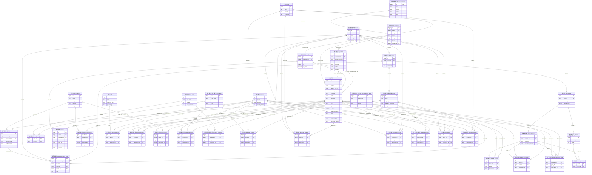

# 完整物理 ER 图

共38张表；主要字段及可选性与建表清单同步。CHECK/UNIQUE/复合外键的详细约束见[schema.sql](schema.sql)。

```mermaid
erDiagram
  compound["化合物 compound"] {
    bigint id PK
    text name
    string inchikey
    text identity_status
  }
  herb["中药 herb"] {
    bigint id PK
    text name
    text medicinal_part
    text processing
  }
  taxon["微生物分类单元 taxon"] {
    bigint id PK
    text name
    text rank
    bigint ncbi_taxid
    bigint parent_id FK
  }
  strain["菌株或MAG归属 strain"] {
    bigint id PK
    bigint taxon_id FK
    text name
    text accession
  }
  genome["基因组装版本 genome"] {
    bigint id PK
    bigint strain_id FK
    text assembly_version
    numeric completeness
    numeric contamination
  }
  microbial_gene["具体微生物基因 microbial_gene"] {
    bigint id PK
    bigint genome_id FK
    text locus_tag
    text sequence_accession
  }
  gene_cluster["基因簇 gene_cluster"] {
    bigint id PK
    bigint genome_id FK
    text name
  }
  cluster_member["簇成员 cluster_member"] {
    bigint cluster_id FK
    bigint gene_id FK
  }
  protein["具体微生物蛋白含酶 protein"] {
    bigint id PK
    text name
    text uniprot_accession
    text sequence_accession
    bigint strain_id FK
  }
  functional_term["功能类别KO EC Pfam CAZy functional_term"] {
    bigint id PK
    text namespace
    text accession
    text release
    text name
  }
  host_gene["宿主基因 host_gene"] {
    bigint id PK
    bigint host_taxid
    text symbol
    text gene_accession
  }
  host_target["宿主蛋白或复合物靶点 host_target"] {
    bigint id PK
    bigint host_taxid
    text name
    text kind
    text accession
  }
  host_gene_product["宿主基因产物 host_gene_product"] {
    bigint gene_id FK
    bigint target_id FK
  }
  disease["疾病 disease"] {
    bigint id PK
    text name
    text ontology
    text accession
  }
  source_record["文献或数据库记录 source_record"] {
    bigint id PK
    text kind
    text locator
    text version
    text title
    text url
  }
  experiment["实验或分析 experiment"] {
    bigint id PK
    bigint source_id FK
    text local_key
    text system
    bigint host_taxid
    text model
    bigint disease_id FK
  }
  study_arm["实验组对照组 study_arm"] {
    bigint id PK
    bigint experiment_id FK
    text name
    integer n
    boolean is_control
  }
  exposure["干预剂量 exposure"] {
    bigint id PK
    bigint arm_id FK
    bigint compound_id FK
    numeric dose
    text dose_unit
    text route
    text duration
  }
  context["样本时间方法 context"] {
    bigint id PK
    bigint experiment_id FK
    text sample_accession
    text site
    text timepoint
    text method
    jsonb conditions
  }
  observation["证据观察 observation"] {
    bigint id PK
    bigint experiment_id FK
    bigint context_id
    bigint subject_arm_id
    bigint control_arm_id
    text endpoint
    text metric
    text direction
    numeric value
    text unit
    numeric p_value
    numeric q_value
    text evidence_method
    text quote
    text location
    text review_status
    text extraction_version
  }
  reaction["化学反应定义 reaction"] {
    bigint id PK
    text name
    text rhea_id
    text direction
    text completeness
  }
  reaction_participant["多底物多产物 reaction_participant"] {
    bigint reaction_id FK
    bigint compound_id FK
    text side
    numeric stoichiometry
    text compartment
  }
  transformation["某实验的转化观察 transformation"] {
    bigint id PK
    bigint reaction_id FK
    bigint observation_id FK
    text substrate_origin
    text product_origin
    text attribution
  }
  transformation_actor["多菌多酶参与者 transformation_actor"] {
    bigint id PK
    bigint transformation_id FK
    bigint taxon_id FK
    bigint strain_id FK
    bigint protein_id FK
    text role
  }
  herb_compound["中药含成分 herb_compound"] {
    bigint id PK
    bigint herb_id FK
    bigint compound_id FK
    bigint observation_id FK
    text role
  }
  gene_product["基因编码蛋白 gene_product"] {
    bigint id PK
    bigint gene_id FK
    bigint protein_id FK
    bigint observation_id FK
  }
  gene_annotation["基因功能注释 gene_annotation"] {
    bigint id PK
    bigint gene_id FK
    bigint term_id FK
    bigint observation_id FK
    text assignment
  }
  protein_annotation["蛋白功能注释 protein_annotation"] {
    bigint id PK
    bigint protein_id FK
    bigint term_id FK
    bigint observation_id FK
    text assignment
  }
  protein_reaction["酶催化反应 protein_reaction"] {
    bigint id PK
    bigint protein_id FK
    bigint reaction_id FK
    bigint observation_id FK
    text assignment
  }
  compound_target["化合物靶点作用 compound_target"] {
    bigint id PK
    bigint compound_id FK
    bigint target_id FK
    bigint observation_id FK
    text action
  }
  compound_host_gene["化合物调控宿主基因 compound_host_gene"] {
    bigint id PK
    bigint compound_id FK
    bigint gene_id FK
    bigint observation_id FK
    text action
  }
  target_disease["靶点疾病关联 target_disease"] {
    bigint id PK
    bigint target_id FK
    bigint disease_id FK
    bigint observation_id FK
    text relation
  }
  microbe_disease["菌疾病关联 microbe_disease"] {
    bigint id PK
    bigint taxon_id FK
    bigint disease_id FK
    bigint observation_id FK
    text relation
  }
  compound_microbe["成分菌变化 compound_microbe"] {
    bigint id PK
    bigint compound_id FK
    bigint taxon_id FK
    bigint observation_id FK
    text measurement
  }
  compound_gene["成分微生物基因调控 compound_gene"] {
    bigint id PK
    bigint compound_id FK
    bigint gene_id FK
    bigint observation_id FK
    text level
  }
  compound_protein["成分微生物酶调控 compound_protein"] {
    bigint id PK
    bigint compound_id FK
    bigint protein_id FK
    bigint observation_id FK
    text level
  }
  cross_feeding["交叉喂养 cross_feeding"] {
    bigint id PK
    bigint donor_id FK
    bigint recipient_id FK
    bigint compound_id FK
    bigint observation_id FK
  }
  compound_disease["干预疾病结局 compound_disease"] {
    bigint id PK
    bigint compound_id FK
    bigint disease_id FK
    bigint observation_id FK
    text relation
  }
  taxon |o--o{ taxon : "parent_id"
  taxon ||--o{ strain : "taxon_id"
  strain ||--o{ genome : "strain_id"
  genome ||--o{ microbial_gene : "genome_id"
  genome ||--o{ gene_cluster : "genome_id"
  gene_cluster ||--o{ cluster_member : "cluster_id"
  microbial_gene ||--o{ cluster_member : "gene_id"
  strain |o--o{ protein : "strain_id"
  host_gene ||--o{ host_gene_product : "gene_id"
  host_target ||--o{ host_gene_product : "target_id"
  source_record ||--o{ experiment : "source_id"
  disease |o--o{ experiment : "disease_id"
  experiment ||--o{ study_arm : "experiment_id"
  study_arm ||--o{ exposure : "arm_id"
  compound ||--o{ exposure : "compound_id"
  experiment ||--o{ context : "experiment_id"
  experiment ||--o{ observation : "experiment_id"
  reaction ||--o{ reaction_participant : "reaction_id"
  compound ||--o{ reaction_participant : "compound_id"
  reaction ||--o{ transformation : "reaction_id"
  observation ||--o{ transformation : "observation_id"
  transformation ||--o{ transformation_actor : "transformation_id"
  taxon |o--o{ transformation_actor : "taxon_id"
  strain |o--o{ transformation_actor : "strain_id"
  protein |o--o{ transformation_actor : "protein_id"
  herb ||--o{ herb_compound : "herb_id"
  compound ||--o{ herb_compound : "compound_id"
  observation ||--o{ herb_compound : "observation_id"
  microbial_gene ||--o{ gene_product : "gene_id"
  protein ||--o{ gene_product : "protein_id"
  observation ||--o{ gene_product : "observation_id"
  microbial_gene ||--o{ gene_annotation : "gene_id"
  functional_term ||--o{ gene_annotation : "term_id"
  observation ||--o{ gene_annotation : "observation_id"
  protein ||--o{ protein_annotation : "protein_id"
  functional_term ||--o{ protein_annotation : "term_id"
  observation ||--o{ protein_annotation : "observation_id"
  protein ||--o{ protein_reaction : "protein_id"
  reaction ||--o{ protein_reaction : "reaction_id"
  observation ||--o{ protein_reaction : "observation_id"
  compound ||--o{ compound_target : "compound_id"
  host_target ||--o{ compound_target : "target_id"
  observation ||--o{ compound_target : "observation_id"
  compound ||--o{ compound_host_gene : "compound_id"
  host_gene ||--o{ compound_host_gene : "gene_id"
  observation ||--o{ compound_host_gene : "observation_id"
  host_target ||--o{ target_disease : "target_id"
  disease ||--o{ target_disease : "disease_id"
  observation ||--o{ target_disease : "observation_id"
  taxon ||--o{ microbe_disease : "taxon_id"
  disease ||--o{ microbe_disease : "disease_id"
  observation ||--o{ microbe_disease : "observation_id"
  compound ||--o{ compound_microbe : "compound_id"
  taxon ||--o{ compound_microbe : "taxon_id"
  observation ||--o{ compound_microbe : "observation_id"
  compound ||--o{ compound_gene : "compound_id"
  microbial_gene ||--o{ compound_gene : "gene_id"
  observation ||--o{ compound_gene : "observation_id"
  compound ||--o{ compound_protein : "compound_id"
  protein ||--o{ compound_protein : "protein_id"
  observation ||--o{ compound_protein : "observation_id"
  taxon ||--o{ cross_feeding : "donor_id"
  taxon ||--o{ cross_feeding : "recipient_id"
  compound ||--o{ cross_feeding : "compound_id"
  observation ||--o{ cross_feeding : "observation_id"
  compound ||--o{ compound_disease : "compound_id"
  disease ||--o{ compound_disease : "disease_id"
  observation ||--o{ compound_disease : "observation_id"
  context |o--o{ observation : "context_id experiment_id"
  study_arm |o--o{ observation : "subject_arm_id experiment_id"
  study_arm |o--o{ observation : "control_arm_id experiment_id"
```
