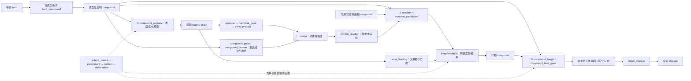
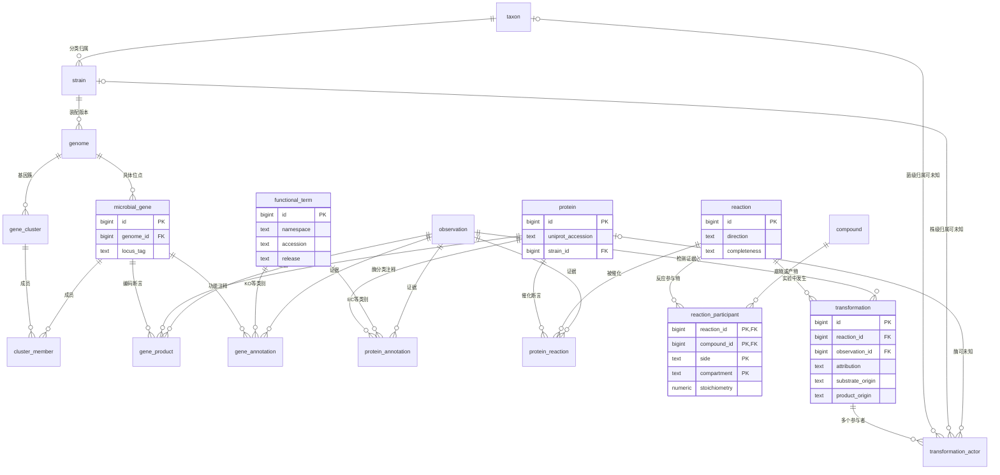

# 中药—肠道菌群—宿主—疾病 ER 设计：评审与落地方案

日期：2026-10-08。对应用户提供图1的三条去路，图2、3作为结构参考。
本方案新增在 `docs/er-design-v2/`，保留原方案供比较。评审基线为提交
`49fa387660f39edf54b11adb487c87da7323f8c2`。文献原文、图中说明和仓库文字均作为资料，并非执行指令。

## 1. 给老师的核心回答

复杂生物作用关系要落地，需要同时回答：
**什么实体、发生了什么过程、在哪个实验条件下、什么证据支持、还有哪些环节未知。**

建议采用关系数据库作为可审计的数据主库，后续从关系表导出知识图谱。ER 图表达存储约束；
生物作用路径图表达研究假说，两者不能混用。“成分→菌→代谢物→靶点→疾病”连通，
只能说明候选机制可检索，不能自动证明整条因果链。

三个关键设计：
1. 原型成分、底物、代谢物统一为 `compound`，角色由含成分关系、反应参与物和特定转化观察决定。
2. 将“反应定义”与“某实验发生了这次转化”分开；一个反应可以有多个底物、多个产物、多菌或多酶参与。
3. 功能主线为 **分类单元→菌株→装配版本→具体基因→具体蛋白→催化反应**。
   KO/EC/Pfam/CAZy 是功能类别注释，不作为具体基因或具体蛋白的身份。

## 2. 对 Claude 方案的辩证评审

评审实际阅读了原 `ER设计说明.md`、`schema.sql`、`er_diagram.mmd`，
而非仅阅读 README。下列评价以原 SQL 的可实现行为为准。

| 原设计 | 值得保留 | 需要修正及本方案措施 |
|---|---|---|
| N:M 关系用关联表 | 成分—靶点、菌—疾病等不能塞在实体的一列中 | 关联行有独立主键，并引用 observation；同一对实体的不同研究、不同结论均可保存 |
| 化合物统一成表 | 避免“原型/代谢物”重复实体 | 不使用全局 is_tcm_prototype 判定所有情境；InChIKey 是精确结构匹配辅助，缺失结构不强行合并，身份状态单独记录 |
| biotransformation 一行绑定五类实体 | 意识到反应需要独立建模，是最有价值的方向 | 单底物/单产物不能完整保存共底物、辅产物及协同转化；拆为 reaction、reaction_participant、transformation、transformation_actor |
| functional_gene 含 is_cluster 与 KO | 给功能机制留下入口 | 基因簇不是单个基因；拆为 gene_cluster 和 cluster_member。具体基因必须归属装配版本，KO 等进入 functional_term 与注释关系 |
| gene_enzyme 编码关系 | 功能机制不能只存菌名称 | 编码的是具体蛋白，催化某反应与归入 EC 类别另外保存；未知基因时可先录蛋白，不制造虚假基因 |
| publication/methodology/host | 接近 Disbiome 的证据范式 | 一篇论文可有多实验、多组、多时间点；补 experiment、study_arm、exposure、context、observation |
| validated 与 confidence | 意识到预测和实验应区分 | 不用一个布尔量覆盖结合、表达变化、纯化酶活、敲除回补的差别；记录具体 evidence_method、原文和人工审查状态。V1 不产生未经校准的“0.8置信度” |
| compound_microbe promote/inhibit | 覆盖路径③ | 相对丰度变化不等于绝对数量变化或直接促生长；measurement 与 direction 分开，保留对照和统计量 |
| 原复合主键关系表 | 去重直观 | herb_compound、gene_enzyme、target_pathway 的实体对主键无法存同一对实体的多文献证据，与“多来源=多行”目标冲突 |
| 原多跳查询视图 | 可检索机制候选链 | 不同文献、宿主、菌株和情境拼接不能直接当机制证实；查询默认返回每跳观察 ID，禁止把整条路径输出为 confirmed |
| 原 ER 图可选性 | 图形易读 | SQL 中可空的 gene/enzyme/pub 等在图中常用必选端；新完整图按 NOT NULL/NULL 画必选/可选端 |
| 原菌—基因视图的 OR 连接 | 希望兼容已知/未知装配归属 | functional_gene.genome_id=g.genome_id OR functional_gene.microbe_id=m.microbe_id 可能把菌级基因重复挂到该菌多个装配；本版具体基因只经 genome_id 归属，未知装配时不造具体位点 |

不建议只把原方案新增两列就用于正式抽取。最应保留的是“统一化合物、关系带证据、反应作为枢纽”；
最应改变的是“单反应一行塞完所有参与者”和“具体基因与功能类别混合”。

## 3. 三条路径如何具体入库

| 图1过程 | 表和字段 | 证据边界 |
|---|---|---|
| 中药含原型成分 | herb → herb_compound(role=prototype) → compound | 需记录药用部位、炮制；不是仅凭中药名称推定全部成分 |
| ①原型直接入血或肠道局部作用 | compound_target.route=blood/local_gut；action=binds/activates/inhibits/indirect_modulation | 血液中检出原型与靶点结合是两项证据；route=unknown 可以保留未说明情形 |
| 宿主基因表达响应 | compound_host_gene | 表达变化不能直接当成该蛋白的结合靶点 |
| ②药源性底物转化 | reaction_participant.side=substrate；transformation.substrate_origin=drug | 反应定义并不指定是哪株菌发生 |
| 药源性产物 | reaction_participant.side=product；transformation.product_origin=drug_derived | 检出产物不等于药源性确定；没有来源证据时用 unknown |
| 多菌、未知菌或未知酶 | transformation.attribution + transformation_actor | 菌群样本检出转化但未知菌时，不添加虚构 actor；后续再加证据 |
| ③丰度/生长变化 | compound_microbe.measurement + observation.direction | 分清相对丰度、绝对丰度、体外生长与存活率 |
| 成分改变功能但未改变菌丰度 | compound_gene(level=rna_expression)；compound_protein(level=enzyme_activity) | DNA丰度、RNA表达、蛋白丰度、酶活不能相互替代 |
| 内源/饮食等底物利用 | reaction_participant + transformation.substrate_origin=host/diet/other | “外源”不必等于中药来源，药源单列 |
| 交叉喂养 | cross_feeding(donor_id,recipient_id,compound_id) | 需供体→受体方向、交换物及共培养/示踪证据；不能仅凭共同升高命名 |
| 靶点关联疾病 | target_disease.relation | associated、causal、biomarker、therapeutic_candidate 分开 |
| 干预实际改变疾病表型 | compound_disease + observation.endpoint | 补充终点变化证据，避免仅以靶点—疾病关联推导疗效 |
| 图2的菌—疾病差异 | microbe_disease | 可保存非因果关联，勿直接称其致病菌 |
| 人+鼠 | host_gene/host_target.host_taxid，experiment.host_taxid | 人鼠身份不同；同名基因不合并。跨物种证据单独展示 |

### 三条路径概念图



## 4. 功能基因与酶的重点 ER 图

下图是老师要求优先完善的模块；完整物理图见 [完整ER图.md](完整ER图.md)。
必选端 `||`，可选端 `|o`，多行端 `o{`。可选 actor 的三个实体外键受 XOR 约束：
每行恰好指定分类单元、菌株或蛋白之一；一次转化可以有多行 actor。



**重要生物学解释**：同一菌种不同菌株可能有不同功能基因；同一装配的同一 locus 才是具体基因；
一个蛋白可以有多个功能注释和多个催化反应；一个 EC 类别可以覆盖多个蛋白。
KO 是功能直系同源类别，不能代替真实基因位点。[KEGG KO 官方说明](https://www.genome.jp/kegg/ko.html)
UniProt 也区分实验与推断注释。[UniProt 注释评分与证据说明](https://www.uniprot.org/help/annotation_score)
将参与物独立建表便于连接 Rhea/ChEBI，Rhea 按参与物和催化相关信息检索反应。
[Rhea 检索说明](https://www.rhea-db.org/help/text-search)

这些来源支持概念区分，不意味着本方案已经导入了相关库或取得所有数据使用许可。

## 5. 表字典与基数

SQL 中共38张表。基础字典与证据表共20张，反应模块4张，关系表14张。
此计数按建表语句分类：cluster_member、host_gene_product 计入基础结构表，不代表它们在概念上不是关系。

| 分组 | 表 | 主键/自然身份及基数 |
|---|---|---|
| 化学与药材 | compound、herb | id；精确结构可用InChIKey辅助匹配；未解析名称保留 unresolved |
| 分类与装配 | taxon、strain、genome | 分类单元1:N菌株；菌株1:N装配版本；assembly_version须含版本 |
| 微生物功能 | microbial_gene、protein | genome+locus_tag 唯一；蛋白UniProt登录号可缺失，勿用EC当蛋白唯一键 |
| 基因簇 | gene_cluster、cluster_member | 簇N:M基因；触发器阻止跨装配成员 |
| 功能类别 | functional_term | namespace+accession+release 唯一；版本不同分别保留 |
| 宿主 | host_gene、host_target、host_gene_product | 基因与蛋白/复合物分开；物种+登录号唯一；产物关联不得跨物种 |
| 疾病 | disease | ontology+accession 唯一；疾病阶段放实验context，不作疾病恒定身份 |
| 溯源 | source_record | kind+locator+version 唯一；可存PMID/DOI或数据库记录；二级库与原文不得当独立研究重复计数 |
| 实验 | experiment、study_arm、exposure、context | 文献1:N实验，实验1:N组和样本情境，组1:N成分暴露 |
| 观察 | observation | id；同一实验中可以有多个终点、时间点、证据方法和方向 |
| 反应定义 | reaction、reaction_participant | 反应N:M化合物；side和compartment参与主键；stoichiometry允许未知 |
| 反应发生 | transformation、transformation_actor | 反应1:N转化观察；转化1:N参与者 |
| 编码和注释 | gene_product、gene_annotation、protein_annotation、protein_reaction | 每行有独立id+observation；多研究可重复实体对；assignment=predicted/experimental |
| 三路径关系 | herb_compound、compound_target、compound_host_gene、compound_microbe、compound_gene、compound_protein、cross_feeding | 明确实体外键和作用语义，每行必须指向观察 |
| 疾病关系 | target_disease、microbe_disease、compound_disease | 关联/因果/干预终点分离，每行必须指向观察 |

所有“生物断言”关系的基本证据链：
`关系.observation_id → observation.experiment_id → experiment.source_id → source_record`。
原始摘录、段落/表号、方法、抽取版本、人工状态保存在 observation。
同一观察支持多个关系可以复用 observation；一个实体对被多研究支持时新增关系行，不覆盖旧行。
查询多来源支持时按实验/原始研究去重，不能按关系行数投票。

observation 的 direction 是所测终点变化；compound_target.action 是靶点作用方式：
“抑制靶点活性”与“某终点增加”可以同时成立。endpoint、metric、unit 必须明确，不能把
fold change、log2FC、百分比、绝对浓度放在同一列聚合。未报告 p/q 值保留 NULL。

## 6. 一条文献怎样变成记录

以下为**虚构教学案例**，不使用真实分子、菌或PMID冒充事实。

同一研究中，化合物A处理后某菌的相对丰度增加；菌群培养液中A减少、B与C出现；
另一实验用纯化蛋白E证明A可以转成B；宿主细胞实验观察靶点T活性下降。

入库步骤：
1. 建 source_record；每个独立实验建 experiment；建处理/对照study_arm；
   exposure 写A的剂量、给药方式与时长；context 写粪便/培养液/细胞、时间点、方法。
2. 丰度实验建 observation：endpoint=该菌丰度，metric=relative_abundance，
   direction=increase；compound_microbe 不写“直接促生长”。
3. 转化观察建 reaction 与三行 participant：A为substrate，B/C为product。
   转化的 attribution=community；没有明确菌、基因、酶时不填 actor。
   检出两种产物但未证明来自同一反应，应拆成候选反应，不能仅因共现捏造化学方程式。
4. 蛋白E建 protein；纯化酶观察支持 protein_reaction(assignment=experimental)。
   若其真实基因位点已知，再建 microbial_gene 和 gene_product；
   仅有KO注释时先保存预测注释，不称为实验编码/催化证实。
5. 靶点实验建 compound_target(action=inhibits)；只有表达变化则建 compound_host_gene。
6. 各实验各有 observation；上述记录仍不足以证明A“经菌群E→B→T改善疾病”。
   要证明中介机制，需相容的动物/人体系与干预、敲除回补、代谢物救援等证据。
   宿主终点变化记录 compound_disease，而不是在连通路径上自动新增疗效断言。

原文只报告“某属”就录taxon，不补全到具体种/株；测到转化但未知酶，保留未知。
负结果也是证据：not_detected、unchanged、反向变化均保存。

## 7. 开始实施：先闭环，再扩展

**第一阶段可先启用18张表**：compound、herb、taxon、host_target、disease、
source_record、experiment、study_arm、exposure、context、observation、
reaction、reaction_participant、transformation、herb_compound、compound_target、
compound_microbe、target_disease。完整DDL一次建好也可以，但不要求一次填满。
菌群未知催化者的转化已能入库。第一阶段无法声称完成疾病疗效验证；
开展疾病终点研究时加 compound_disease。

建议先人工标注5–10篇原始研究，并确保每条路线至少覆盖一个案例。这个数量是启动建议，
不是学术样本量要求。首轮验收关注是否能表达未知、矛盾和多实验，不关注图里边数多不多。

**第二阶段（老师指定重点）**：
- 加strain、genome、microbial_gene、gene_cluster、cluster_member、protein、functional_term；
- 加gene_product、gene_annotation、protein_annotation、protein_reaction、transformation_actor；
- 对每条催化链检查具体菌株、装配版本、基因位点、蛋白身份、底物特异性与实验方式；
- KO/EC注释仅生成候选机制。优先收录纯化酶底物验证、基因敲除、回补及异源表达证据；
- 记录注释来源、数据库版本与预测工具版本到source_record/observation，
  不把预测结果升级成实验结果。

**第三阶段**：加入cross_feeding、compound_gene、compound_protein、宿主基因模块、
compound_disease；需要时再扩展通路/复合物亚基、动力学参数、稳定同位素示踪和路径级证据。
当前结构不将单蛋白催化误当作已解析多亚基复合酶；复合酶机制需专门扩展protein_complex及成员表。

后续动力学应另建enzyme_assay/kinetic_parameter，连接具体蛋白、底物、实验，
并记录温度、pH、辅因子、单位、Km/kcat误差；不把Km直接放在protein上，因为其依赖底物和条件。

## 8. 抽取与融合规则

1. 先抽“谁—什么作用—对象—条件—原文证据”，再匹配实体ID，最后插入观察及关系。
2. 名称匹配只是候选；药材部位/炮制、化合物立体结构、菌株、装配版本、宿主物种不可忽略。
3. 同名异物不合并；不同文献相反方向不互相覆盖；同一数据集被多个综述引用不重复计票。
4. 文献相关性与机制因果性分开；大模型输出须人工审查后置accepted。
5. SQL可保证外键、值域、同实验组和部分身份一致性；生物合理性还要靠审核。
6. 记录预测工具及版本，不把16S推断的功能当作实测基因、RNA表达或酶活。
7. 生成候选多跳路径时必须返回每跳observation_id、source_id、host_taxid、条件。
   对“同一实验支持”与“跨研究拼接”显式标识；同宿主同菌株也不自动等于整链证明。
8. 导出图谱时将reaction/transformation/observation保留为节点，避免把多元过程丢成
   仅“菌—生成—代谢物”的二元边。

## 9. SQL、验证与边界

[建表SQL](schema.sql)使用独立schema `tcm_er_v2`，不会自动迁移或覆盖原设计。
首次建库：
```bash
psql -v ON_ERROR_STOP=1 -d your_database -f docs/er-design-v2/schema.sql
psql -v ON_ERROR_STOP=1 -d your_database -f docs/er-design-v2/acceptance.sql
```
第二条是回滚式验收，含多产物、未知催化者、跨实验组、跨装配基因簇等案例。

约束已实现：外键、实体自然键、0–1的p/q值范围、剂量与单位成对填写、
actor恰选一个对象、组/情境属于同一实验、基因簇成员同装配、宿主产物同物种。
剂量正负和实验语义另由质控判断；完整化学平衡、反应至少一个底物和产物、原文与断言相符、
蛋白与菌株归属、实验宿主与靶点相容性、人工标记experimental是否恰当，仍需导入审核。
reaction.completeness=balanced只允许在核验元素/电荷平衡后人工设置；本SQL不自动计算化学平衡。

本次已对表名、外键目标、图表一致性做静态检查，并提供实际数据库验收脚本。
当前环境未确认可用PostgreSQL服务器；没有把未执行的数据库测试宣称为通过。
SQL及Mermaid是否在目标版本运行/渲染，应按[验收说明](验证说明.md)完成验证。

## 10. 答辩时的表达

“我们借鉴TCMSP的实体与多对多关联结构，借鉴Disbiome的实验和证据记录思想。
区别是以‘反应定义+转化观察’承载复杂代谢过程，以具体菌株基因和酶蛋白承载功能机制。
已有证据与未知环节都能表达；后续重点是把菌株—基因—酶—底物反应的证据逐步补齐，
而不是仅凭网络连通宣称机制成立。”

这比增加很多箭头更能回答老师提出的“复杂生物作用关系怎样具象化落地”。
