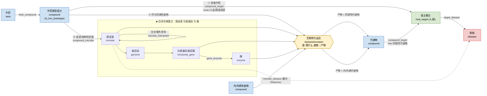

# 中药原型成分 – 肠道菌群 – 宿主靶点 – 疾病 知识图谱数据库 ER 设计

> 目标：把框架图（图1）中"中药原型成分 → 肠道菌群 → 宿主基因/靶点 → 疾病"的作用网络，
> 落成一个**可存储、可检索、可扩展**的关系型数据库 ER 模型。
> 核心难点是把"复杂生物作用关系**具象化落地**"，并把"**肠道菌功能基因与酶**"设为后续深化重点。

---

## 0. 一句话结论

> **把图里每一条"箭头/过程"都升级成一张"带属性的关系表（关联实体）"，表里记录
> 方向 + 作用类型 + 发生条件(体内/体外) + 证据(PMID/方法/宿主) + 置信度；
> 最难的"菌把底物转化成代谢物"这一段，用一张核心反应表 `biotransformation` 把
> 『谁(菌) — 用什么(功能基因/酶) — 把什么(底物) — 变成什么(产物)』四要素绑到同一行。**

这就是"具象化落地"的全部秘密。下面展开。

---

## 1. 建模总思路（怎么搞）

参照**图3（TCMSP）的 ER 构建逻辑** + **图2（Disbiome）的证据化范式**，归纳成一条主线：

> **先定实体 → 给每个实体定主键 → 判断实体间是 1:1 / 1:N / N:M →
> 1:N 用外键直接连接，N:M 用中间关系表连接 →
> 把"关系本身的方向、作用类型、发生条件、证据(PMID/方法/宿主)、置信度"全部放进关系表。**

这正是图3顶部那段话的生物学版本。它之所以好用，是因为生物网络里几乎所有关系都是 **N:M**
（一个成分作用多个靶点、一个靶点被多个成分作用；一种菌代谢多种底物、一种底物被多种菌代谢……），
所以**中间关系表才是这个库的主体**，实体表反而是配角。

### 1.1 具象化落地的三条原则（难点破解）

框架图里每个"箭头"都是一句模糊的生物学语义。要落地，就按下面三条把它变成结构化记录。

#### 原则 A：把"箭头"升级为"关联实体"（关系也是一张表，有自己的属性）

一条边不是一根连线，而是**一行记录**。例如"丹参素作用于某靶点"落地成：

| 字段 | 取值示例 | 含义 |
|---|---|---|
| compound_id | 丹参素 | 作用物 |
| target_id | Keap1 | 被作用靶点 |
| action_type | 抑制 | 作用方式 |
| action_route | 吸收入血 | 发生方式（捕捉路线①两条子路径）|
| effect_direction | 下调 | 方向 |
| evidence_type | in_vivo | 体内/体外/计算 |
| pub_id → PMID | 12345678 | 证据来源 |
| confidence | 0.8 | 置信度 |

于是"A 作用于 B"升级为"**在某文献、某体系下，A 以某方式、某方向作用于 B，证据强度 X**"——
模糊语义被完全结构化。

#### 原则 B：把最难的"菌代谢底物生成代谢物"**反应化（reify）**

框架图中段最"散"：`原型成分/底物 → 细菌基因组 → 功能基因/基因簇 → 代谢产物`。
把这一整段压缩成**一张核心关联实体** `biotransformation`（生物转化反应），一行绑定四要素：

```
biotransformation
 ├─ substrate_compound_id   谁被转化（底物：原型成分 / 内源 / 外源）
 ├─ product_compound_id     变成了什么（产物：药源性 / 内源 / 外源代谢物）
 ├─ microbe_id              哪种菌在催化
 ├─ gene_id                 哪个功能基因/基因簇（★重点）
 ├─ enzyme_id               哪个酶（★重点）
 ├─ reaction_type           反应类型（水解/还原/去糖基化/脱羟基…）
 └─ substrate_role / product_role + 证据字段
```

**路线②（转化原型成分 → 药源性代谢物）和路线③的代谢段（转化内/外源底物 → 代谢物）
共用这一张表**，只用 `substrate_role` / `product_role` 两个字段区分。
这是整张框架图最难的一段**一次性落地**的关键，也是"功能基因与酶"的安放之处。

#### 原则 C：化学物只建**一个**实体，"角色"放在边上

原型成分、底物、代谢物，本质都是**化学物**——而且同一个分子可以同时是某反应的产物、
又是下一反应的底物（代谢是链式的）。所以：

- 只建**一张 `compound` 表**，用 **InChIKey 作跨库唯一键**（图3里也强调 inchikey 是跨库匹配的重要字段）；
- "它此刻是原型 / 底物 / 药源性代谢物 / 微生物代谢物"这种**角色**，写在
  `biotransformation.substrate_role / product_role` 和 `compound_target.compound_role` 字段里。

这样避免同一分子被重复录三份（原型一份、底物一份、代谢物一份），保证可追溯、可聚合、不打架。

> **备选方案（如导师坚持按框架节点显式分表）**：可对 `compound` 建子类型表
> `prototype_component` / `substrate` / `metabolite`，共享 `compound_id` 做 ISA 继承。
> 代价是数据冗余和一致性维护成本，默认**不推荐**，仅在汇报时作为"我们考虑过的取舍"说明。

### 1.2 证据化（借鉴图2 Disbiome）

Disbiome 的核心实体是 **Experiment（一次观测）**——每条"菌在某病里升高/降低"都是一次带
参数的实验。我们沿用这个精神：

- **关系表按"断言行"组织**：一行 = 一条来自某来源的证据，带 `PMID`、`method_id`(方法)、
  `host_id`(宿主体系)、定性方向、统计量、`confidence`。
- **多来源 = 多行**；"共识/合并"用**视图(VIEW)** 聚合，不在原始表里硬合，保留原始可追溯性。
- 抽出三张**共享元数据实体**：`publication`(文献)、`methodology`(方法学：16S/宏基因组/代谢组…)、
  `host`(宿主体系：人 / 鼠 / 无菌鼠 / 人源化菌群鼠)——对应框架里的"**人 + 鼠**"。

---

## 2. 实体清单（13 个核心实体）

> 命名用 snake_case、主键一律 `<实体>_id`。标【★FOCUS】的是"肠道菌功能基因与酶"深化脊柱。

| 实体表 | 中文 | 主键 | 关键属性 | 对照来源 |
|---|---|---|---|---|
| `herb` | 中药 | herb_id | cn_name, pinyin, latin_name, family, part_used(药用部位), category_id→ | TCMSP InfoHerb |
| `herb_category` | 中药分类 | category_id | cn_name, en_name, **parent_id(自引用)** | TCMSP InfoChild |
| `compound` | 化合物 / 原型成分（统一化学实体）| compound_id | **inchikey(唯一)**, name, formula, mw, smiles, pubchem_cid, cas, **is_tcm_prototype**, ob/caco2/bbb/drug_likeness/tpsa… | TCMSP InfoMolecule |
| `microbe` | 微生物 / 菌（含分类层级）| microbe_id | scientific_name, **ncbi_taxon_id(唯一)**, rank(门纲目科属种株), **parent_taxon_id(自引用)**, silva_id, gtdb_id, oxygen_requirement | Disbiome Organism ★FOCUS域 |
| `genome` | 细菌基因组 | genome_id | microbe_id→, assembly_accession, strain_name, genome_size_bp | 新增 ★FOCUS |
| `functional_gene` | **功能基因 / 基因簇** | gene_id | genome_id→, microbe_id→, gene_symbol, **ko_id(KEGG)**, cog_id, pfam_id, cazy_family, **is_cluster**, cluster_type, annotation_evidence | 新增 ★★FOCUS 重点 |
| `enzyme` | **酶** | enzyme_id | **ec_number**, name, enzyme_class, reaction_family(如 BSH/偶氮还原酶/GH), cofactor | 新增 ★★FOCUS 重点 |
| `host` | 宿主 / 实验体系 | host_id | species(人/鼠), model(无菌鼠/人源化菌群鼠/C57BL/6), condition | Disbiome Host |
| `host_target` | 宿主基因 / 靶点 | target_id | gene_symbol, uniprot_id, entrez_id, **organism(人/鼠)**, target_type, drugbank_id | TCMSP InfoTarget |
| `pathway` | 信号通路 | pathway_id | name, source(KEGG/Reactome), external_id | 新增（可选）|
| `disease` | 疾病 | disease_id | name, icd9, icd10, mesh_id, do_id, **meddra_id**, stage | TCMSP InfoDisease + Disbiome Disease |
| `publication` | 文献 | pub_id | **pmid(唯一)**, doi, first_author, title, journal, year | Disbiome/TCMSP Publication |
| `methodology` | 方法学 | method_id | detection_method(16S/宏基因组/代谢组/qPCR), platform, sampling_location | Disbiome Methodology |

---

## 3. 关系（关联）清单 —— 三条去路如何落地

> 每张关系表都是"**带证据的断言**"：除下列业务字段外，均隐含
> `pub_id`(→PMID)、`host_id`、`method_id`、`evidence_type`、`confidence` 等证据字段（详见 `schema.sql`）。

| 关系表 | 中文 | 连接 | 核心业务字段 | 对应路线 |
|---|---|---|---|---|
| `herb_compound` | 中药-成分 | herb × compound | content(含量), part | 基础 |
| `gene_enzyme` | 功能基因-酶 | functional_gene × enzyme | relation=encodes, annotation_evidence | ★FOCUS |
| `biotransformation` | **生物转化反应（核心枢纽）** | compound(底物)×compound(产物)×microbe×functional_gene×enzyme | substrate_role, product_role, reaction_type, ec_number | **路线②③代谢段 ★★枢纽** |
| `compound_target` | 化合物-靶点 作用 | compound × host_target | **compound_role**, action_type, **action_route**, effect_direction, validated | **路线①②③ 收口** |
| `target_disease` | 靶点-疾病 | host_target × disease | relation(致病/治疗/标志物), direction | 三路线共同收口 |
| `target_pathway` | 靶点-通路 | host_target × pathway | role | 可选 |
| `compound_microbe` | 成分-菌 丰度调控 | compound × microbe | **effect(促进/抑制)**, abundance_change(上升/下降), fold_change | **路线③「促进或抑制特定菌」** |
| `microbe_interaction` | 菌-菌 交叉喂养/竞争 | microbe × microbe(自引用) | interaction_type, exchanged_compound_id | **路线③「底物利用与交叉喂养」** |
| `microbe_disease` | 菌-疾病 关联 | microbe × disease | direction(富集/减少) | 整合 Disbiome（交叉验证）|
| `compound_enzyme_modulation` | 成分对菌功能基因/酶 的调控 | compound × enzyme / functional_gene | effect(诱导/抑制) | 路线③ 深机制 ★FOCUS 扩展 |

### 三条去路 → 表的组合路径

- **路线① 原型成分直接作用**
  `compound(is_tcm_prototype)` → **`compound_target`**(compound_role=`prototype_direct`,
  action_route=`absorbed_blood` 入血 / `local_gut` 肠道局部) → **`target_disease`** → `disease`

- **路线② 原型成分被菌群转化（→药源性代谢物）**
  `compound`(底物) → **`biotransformation`**(substrate_role=`drug_substrate` → product_role=`drug_derived`，
  绑定 microbe + functional_gene + enzyme) → `compound`(产物) →
  **`compound_target`**(compound_role=`drug_derived_metabolite`) → **`target_disease`** → `disease`

- **路线③ 原型成分扰动肠道菌群**
  `compound` → **`compound_microbe`**(促进/抑制、丰度上升/下降) 改变菌群组成；
  菌群内 **`microbe_interaction`**(交叉喂养/竞争) + **`biotransformation`**(substrate_role=`endogenous`/`exogenous`)
  改变内/外源底物代谢 → `compound`(产物) →
  **`compound_target`**(compound_role=`microbial_metabolite`) → **`target_disease`** → `disease`。
  更深机制（成分改变菌的**功能**而非仅丰度）用 **`compound_enzyme_modulation`**。

---

## 4. 框架图（图1）↔ 数据库 对照表

| 图1 中的元素 | 落到的实体 / 关系 / 字段 |
|---|---|
| 中药原型成分 | `compound` where `is_tcm_prototype = true` |
| ①直接吸收入血 / 肠道局部作用 | `compound_target.action_route` = `absorbed_blood` / `local_gut` |
| ③促进或抑制特定菌 | `compound_microbe.effect` = `promote` / `inhibit` |
| ③底物利用与交叉喂养 | `microbe_interaction` + `biotransformation` |
| 内源性 / 外源性底物 | `biotransformation.substrate_role` = `endogenous` / `exogenous` |
| 细菌基因组（多个单菌的基因组）| `genome`（挂到 `microbe`）|
| 功能基因 / 基因簇 | `functional_gene`（`is_cluster` 区分基因/基因簇）★ |
| 酶（功能酶）| `enzyme` + `gene_enzyme`(基因编码酶) ★ |
| 代谢产物（内源/外源/药源性）| `compound`(作为产物) + `biotransformation.product_role` |
| 药源性代谢物作用于靶点 | `compound_target.compound_role` = `drug_derived_metabolite` |
| 宿主基因（人+鼠）靶点 | `host_target.organism` = `human` / `mouse` |
| 疾病 | `disease` |

一眼就能看出：**框架图里每一个词、每一个箭头都在库里有对应落点**——这就是"具象化落地"的验收标准。

---

## 5. 后续完善重点：肠道菌功能基因与酶（★FOCUS）

把 **`microbe → genome → functional_gene → enzyme → biotransformation`** 作为深化的"**脊柱**"。
当前先把结构搭好、留好扩展位，后续按下面逐步填深：

- **functional_gene（功能基因/基因簇）**
  - 注释多来源：`ko_id`(KEGG Ortholog)、`cog_id`、`pfam_id`、`cazy_family`(碳水化合物酶)、`tcdb_id`(转运蛋白)；
  - `is_cluster` + `cluster_type`：对接 **antiSMASH / gutSMASH** 挖掘的生物合成基因簇(BGC)；
  - `annotation_evidence`：区分「基因组注释**预测**」vs「实验**验证**」。
- **enzyme（酶）**
  - `ec_number`(EC 号) 作主检索键；`reaction_family`（如胆盐水解酶 BSH、偶氮还原酶、β-葡萄糖醛酸酶、GH 家族）；
  - 预留动力学参数（Km / kcat）、底物特异性、辅因子，供后续精细化。
- **关系深化**
  - `gene_enzyme`(N:M)：一个酶家族对应多个基因、一个基因可编码多功能酶；
  - `enzyme ↔ reaction`：经 `biotransformation` 落地；`reaction ↔ pathway`：后续接 `pathway`。
- **菌株级分辨率**：`genome` 把基因绑定到**具体菌株**，区分"KO/泛基因组层"与"菌株层"证据。
- **证据分级**：`biotransformation.evidence_type` + `compound_target.validated`（借鉴 TCMSP 的 `validated` 字段）。
- **外部库对接**：KEGG、UniProt、CAZy、BRENDA、MetaCyc、gutSMASH ——用上述外部 ID 字段做跨库匹配。

> 换句话说：**第一版先把 `functional_gene` 和 `enzyme` 两张表 + `gene_enzyme` + `biotransformation`
> 这"四件套"立起来（哪怕先只填 KO/EC 两个字段），它就是整库的承重墙，之后所有深化都往这里加列、加行。**

---

## 6. ER 图

### 6.1 概念去路图（图1 → 实体/关系 的落地映射）



### 6.2 完整 ER 图（实体 + 关联实体 + 证据）

> 带属性的关系（如 `biotransformation`、`compound_target`）在 ER 图里画成**独立方块（关联实体）**，
> 这正是"把箭头具象化成表"的可视化表达。`publication/host/methodology` 为证据元数据，所有断言表都挂它们
> （图中仅示意连到枢纽与主要断言表，其余以同名外键列承载）。
> **实体名与关系标签均为「中文 English」双语对照；列名保持英文(SQL 友好) + 中文注释。**

```mermaid
erDiagram
  HERB_CATEGORY ||--o{ HERB : "分类 category"
  HERB ||--o{ HERB_COMPOUND : "含有 has"
  COMPOUND ||--o{ HERB_COMPOUND : "存在于 in"

  MICROBE ||--o{ MICROBE : "分类上级 parent"
  MICROBE ||--o{ GENOME : "拥有 has"
  GENOME ||--o{ FUNCTIONAL_GENE : "包含 contains"
  MICROBE ||--o{ FUNCTIONAL_GENE : "携带 carries"
  FUNCTIONAL_GENE ||--o{ GENE_ENZYME : "编码 encodes"
  ENZYME ||--o{ GENE_ENZYME : "被编码 encoded_by"

  COMPOUND ||--o{ BIOTRANSFORMATION : "底物 substrate"
  COMPOUND ||--o{ BIOTRANSFORMATION : "产物 product"
  MICROBE ||--o{ BIOTRANSFORMATION : "催化菌 catalyst"
  FUNCTIONAL_GENE ||--o{ BIOTRANSFORMATION : "催化基因 gene"
  ENZYME ||--o{ BIOTRANSFORMATION : "催化酶 enzyme"

  COMPOUND ||--o{ COMPOUND_TARGET : "作用物 actor"
  HOST_TARGET ||--o{ COMPOUND_TARGET : "被作用 acted_on"
  HOST_TARGET ||--o{ TARGET_DISEASE : "关联 relates"
  DISEASE ||--o{ TARGET_DISEASE : "关联 relates"
  HOST_TARGET ||--o{ TARGET_PATHWAY : "参与 in"
  PATHWAY ||--o{ TARGET_PATHWAY : "包含 has"

  COMPOUND ||--o{ COMPOUND_MICROBE : "调控 modulates"
  MICROBE ||--o{ COMPOUND_MICROBE : "被调控 modulated"
  MICROBE ||--o{ MICROBE_INTERACTION : "菌A microbe_A"
  MICROBE ||--o{ MICROBE_INTERACTION : "菌B microbe_B"
  MICROBE ||--o{ MICROBE_DISEASE : "关联 relates"
  DISEASE ||--o{ MICROBE_DISEASE : "关联 relates"

  COMPOUND ||--o{ COMPOUND_ENZYME_MODULATION : "调控 modulates"
  ENZYME ||--o{ COMPOUND_ENZYME_MODULATION : "被调控 modulated"
  FUNCTIONAL_GENE ||--o{ COMPOUND_ENZYME_MODULATION : "被调控 modulated"

  PUBLICATION ||--o{ BIOTRANSFORMATION : "证据 evidence"
  PUBLICATION ||--o{ COMPOUND_TARGET : "证据 evidence"
  PUBLICATION ||--o{ COMPOUND_MICROBE : "证据 evidence"
  PUBLICATION ||--o{ TARGET_DISEASE : "证据 evidence"
  PUBLICATION ||--o{ MICROBE_DISEASE : "证据 evidence"
  HOST ||--o{ BIOTRANSFORMATION : "体系 host"
  HOST ||--o{ COMPOUND_MICROBE : "体系 host"
  METHODOLOGY ||--o{ BIOTRANSFORMATION : "方法 method"
  METHODOLOGY ||--o{ COMPOUND_MICROBE : "方法 method"

  COMPOUND["化合物/成分 Compound"] {
    bigint compound_id PK
    string inchikey "唯一·跨库键 unique key"
    string name "名称 name"
    bool is_tcm_prototype "是否原型成分 is prototype"
    float ob "口服生物利用度 oral bioavail."
    float drug_likeness "类药性 drug-likeness"
  }
  MICROBE["肠道菌 Microbe"] {
    bigint microbe_id PK
    string scientific_name "学名 sci. name"
    string ncbi_taxon_id "唯一 unique"
    string rank "分类级别 rank"
    bigint parent_taxon_id FK "分类上级 parent"
  }
  GENOME["细菌基因组 Genome"] {
    bigint genome_id PK
    bigint microbe_id FK "所属菌 microbe"
    string assembly_accession "装配号 accession"
    string strain_name "菌株 strain"
  }
  FUNCTIONAL_GENE["功能基因/基因簇 FunctionalGene"] {
    bigint gene_id PK
    bigint genome_id FK "基因组 genome"
    bigint microbe_id FK "菌 microbe"
    string ko_id "KEGG 直系同源 KO"
    string cazy_family "碳水酶家族 CAZy"
    bool is_cluster "是否基因簇/BGC cluster"
  }
  ENZYME["酶 Enzyme"] {
    bigint enzyme_id PK
    string ec_number "EC 号 EC no."
    string reaction_family "反应家族 family"
    string cofactor "辅因子 cofactor"
  }
  GENE_ENZYME["功能基因-酶 Gene_Enzyme"] {
    bigint gene_id FK "基因 gene"
    bigint enzyme_id FK "酶 enzyme"
    string annotation_evidence "证据 predicted/exp."
  }
  BIOTRANSFORMATION["生物转化反应 Biotransformation"] {
    bigint rxn_id PK
    bigint substrate_compound_id FK "底物 substrate"
    bigint product_compound_id FK "产物 product"
    bigint microbe_id FK "催化菌 microbe"
    bigint gene_id FK "功能基因 gene"
    bigint enzyme_id FK "酶 enzyme"
    string substrate_role "底物角色 subst. role"
    string product_role "产物角色 prod. role"
    string reaction_type "反应类型 rxn type"
    string evidence_type "证据类型 in_vitro/vivo"
    bigint pub_id FK "文献 publication"
  }
  HOST_TARGET["宿主靶点 HostTarget"] {
    bigint target_id PK
    string gene_symbol "基因符号 symbol"
    string uniprot_id "UniProt 号"
    string organism "物种 human/mouse"
    string target_type "靶点类型 type"
  }
  COMPOUND_TARGET["成分-靶点 Compound_Target"] {
    bigint ct_id PK
    bigint compound_id FK "成分 compound"
    bigint target_id FK "靶点 target"
    string compound_role "成分角色 role"
    string action_type "作用方式 action"
    string action_route "发生途径 route"
    bool validated "实验验证 validated"
    bigint pub_id FK "文献 publication"
  }
  DISEASE["疾病 Disease"] {
    bigint disease_id PK
    string name "名称 name"
    string icd10 "ICD-10 编码"
    string meddra_id "MedDRA 号"
  }
  TARGET_DISEASE["靶点-疾病 Target_Disease"] {
    bigint td_id PK
    bigint target_id FK "靶点 target"
    bigint disease_id FK "疾病 disease"
    string relation "关系 relation"
    bigint pub_id FK "文献 publication"
  }
  COMPOUND_MICROBE["成分-菌调控 Compound_Microbe"] {
    bigint cm_id PK
    bigint compound_id FK "成分 compound"
    bigint microbe_id FK "菌 microbe"
    string effect "效应 promote/inhibit"
    string abundance_change "丰度变化 up/down"
    bigint pub_id FK "文献 publication"
  }
  MICROBE_INTERACTION["菌-菌互作 Microbe_Interaction"] {
    bigint mi_id PK
    bigint microbe_a_id FK "菌A microbe A"
    bigint microbe_b_id FK "菌B microbe B"
    string interaction_type "互作类型 type"
    bigint exchanged_compound_id FK "交换物 exchanged"
  }
  MICROBE_DISEASE["菌-疾病 Microbe_Disease"] {
    bigint md_id PK
    bigint microbe_id FK "菌 microbe"
    bigint disease_id FK "疾病 disease"
    string direction "方向 enriched/depleted"
    bigint pub_id FK "文献 publication"
  }
  COMPOUND_ENZYME_MODULATION["成分调控菌酶 Compound_Enzyme_Modulation"] {
    bigint cem_id PK
    bigint compound_id FK "成分 compound"
    bigint enzyme_id FK "酶 enzyme"
    bigint gene_id FK "功能基因 gene"
    string effect "效应 induce/inhibit"
  }
  HERB["中药 Herb"] {
    bigint herb_id PK
    string cn_name "中文名 cn name"
    string pinyin "拼音 pinyin"
    bigint category_id FK "分类 category"
  }
  HERB_CATEGORY["中药分类 HerbCategory"] {
    bigint category_id PK
    string cn_name "中文名 cn name"
    bigint parent_id FK "上级 parent"
  }
  HERB_COMPOUND["中药-成分 Herb_Compound"] {
    bigint herb_id FK "中药 herb"
    bigint compound_id FK "成分 compound"
    string content "含量 content"
  }
  PATHWAY["信号通路 Pathway"] {
    bigint pathway_id PK
    string name "名称 name"
    string source "来源 KEGG/Reactome"
  }
  TARGET_PATHWAY["靶点-通路 Target_Pathway"] {
    bigint target_id FK "靶点 target"
    bigint pathway_id FK "通路 pathway"
  }
  PUBLICATION["文献 Publication"] {
    bigint pub_id PK
    string pmid "唯一 PMID"
    string doi "DOI"
    int year "年份 year"
  }
  HOST["宿主 Host"] {
    bigint host_id PK
    string species "物种 human/mouse"
    string model "模型 model"
  }
  METHODOLOGY["方法学 Methodology"] {
    bigint method_id PK
    string detection_method "检测方法 method"
    string platform "平台 platform"
  }
```



> 两张图的可编辑源码另存于 `diagrams/framework.mmd` 与 `diagrams/er_diagram.mmd`，
> 可直接粘到 <https://mermaid.live> 调整布局后导出 PNG/SVG 用于汇报。

---

## 7. 落地与技术实现

- **数据库**：PostgreSQL（与 Disbiome 一致）。`schema.sql` 可直接 `psql -f schema.sql` 建库。
- **唯一/自然键**：`compound.inchikey`、`microbe.ncbi_taxon_id`、`enzyme.ec_number`、`publication.pmid`。
- **索引**：所有外键列 + `inchikey` / `ec_number` / `ko_id` / `ncbi_taxon_id` 建索引。
- **受控词表**：`*_role` / `effect` / `direction` 等用 `CHECK` 约束固定取值（见 `schema.sql`），保证可聚合。
- **共识视图**：对同一断言的多篇证据用 VIEW 聚合（`schema.sql` 末给了 `v_microbe_gene_enzyme`
  和一个成分→疾病多跳路径的示例写法）。
- **升级为知识图谱**：关系表天然就是三元组 `(head, relation, tail, 属性...)`，
  后续可一键导出到 Neo4j / RDF 构建可推理的知识图谱（本仓库名即"知识图谱抽取与融合"）。

---

## 8. 文件清单

| 文件 | 内容 |
|---|---|
| `docs/er-design/ER设计说明.md` | 本文档（思路 + 字典 + 对照 + 两张图）|
| `docs/er-design/schema.sql` | PostgreSQL 建库 DDL（13 实体 + 10 关系表 + 索引 + 示例视图）|
| `docs/er-design/diagrams/framework.mmd` | 概念去路图（Mermaid 源码）|
| `docs/er-design/diagrams/er_diagram.mmd` | 完整 ER 图（Mermaid 源码）|
